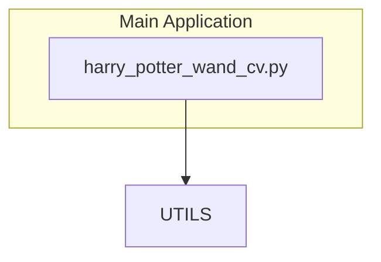
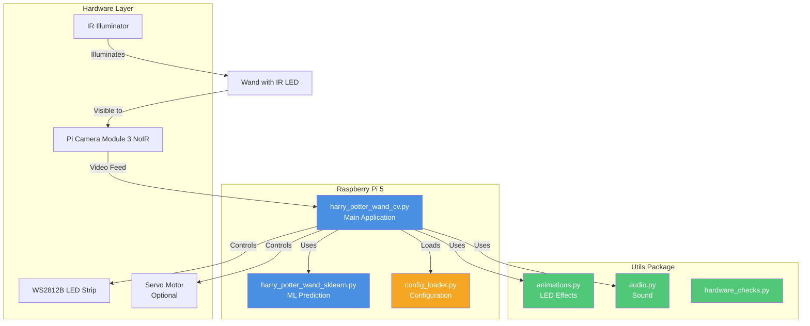
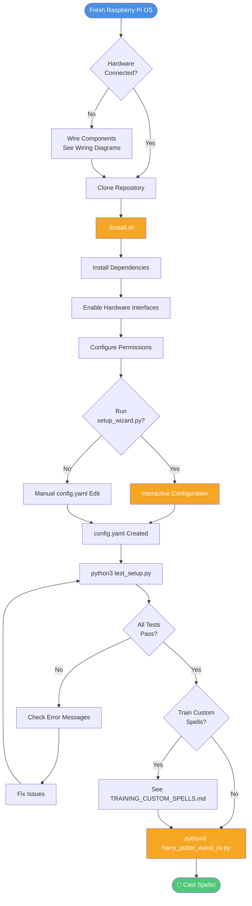
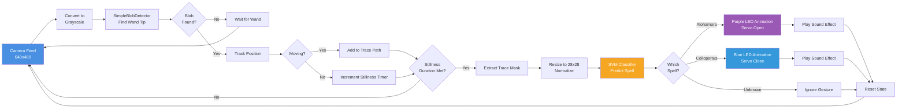
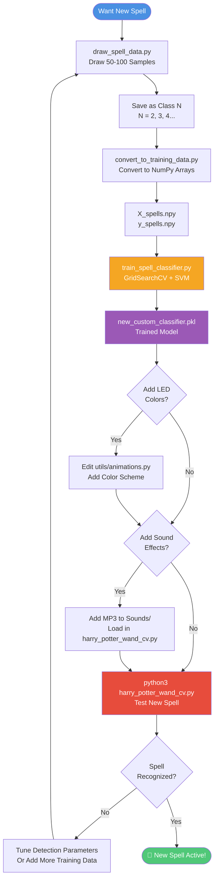

# Task PRP: Documentation Validation and Enhancement

**Status:** Ready for Execution
**Priority:** Medium
**Estimated Time:** 2-3 hours
**Risk Level:** Low (documentation only, no code changes)

---

## Context

### Recent Changes Requiring Documentation Updates

```yaml
recent_refactoring:
  - file_renames:
      - "HarryPotterWandcv.py → harry_potter_wand_cv.py"
      - "HarryPotterWandsklearn.py → harry_potter_wand_sklearn.py"
  - new_modules:
      - "utils/terminal_ui.py"
      - "utils/hardware_checks.py"
      - "utils/config_builder.py"
      - "utils/animations.py"
      - "utils/audio.py"
  - architecture_changes:
      - "GestureState class created"
      - "State management refactored"
      - "LED/audio utilities extracted"

docs_already_updated:
  - README.md: "File references updated to snake_case"
  - install.sh: "File references updated"
  - test_setup.py: "File references updated"
  - utils/config_builder.py: "File references updated"
  - docs/REFACTORING_METRICS.md: "Comprehensive with Mermaid diagrams"
```

### Documentation Files to Validate

```yaml
primary_docs:
  - README.md: "Main project documentation"
  - docs/CONFIGURATION.md: "Config file guide"
  - docs/TRAINING_CUSTOM_SPELLS.md: "ML training guide"

research_docs:
  - docs/research/CAMERA_MODULE_3_NOIR_RESEARCH.md
  - docs/research/IR_ILLUMINATOR_INTEGRATION_RESEARCH.md
  - docs/research/WIRING_DIAGRAMS.md
  - docs/research/WS2812B_RaspberryPi5_Integration_Report.md
  - docs/research/PYTHON_INSTALLATION_SETUP_BEST_PRACTICES.md

prp_docs:
  - PRPs/tasks/automated-installation-setup.md
  - PRPs/tasks/tech-debt-cleanup-complete.md
  - PRPs/completed/readme-hardware-setup-update.md
```

### Mermaid Diagram Opportunities

```yaml
readme_potential:
  - hardware_architecture: "Pi5 → Camera, LEDs, Servo, IR"
  - installation_flow: "install.sh → setup_wizard.py → config.yaml"
  - gesture_detection_flow: "Camera → Blob Detect → Trace → ML → Spell"

configuration_potential:
  - config_structure: "YAML hierarchy visualization"
  - hardware_dependencies: "Which settings affect which components"
  - tuning_workflow: "Iterative parameter adjustment process"

training_potential:
  - ml_pipeline: "Data collection → Training → Testing → Deployment"
  - spell_lifecycle: "Draw → Save → Train → Deploy → Test"
  - color_customization: "RGB value → LED animation flow"

wiring_potential:
  - circuit_diagrams: "Component connections and power flow"
  - gpio_pinout: "Pin assignments for different components"
```

### Pattern Examples

```markdown
# Good Mermaid Integration Pattern (from REFACTORING_METRICS.md)

## Module Architecture



**Key Observations:**
- Clear visual hierarchy
- Color-coded categories
- Annotations explaining relationships
```

---

## Task Breakdown

### Phase 1: File Reference Validation (30 min)

#### Task 1.1: Validate README.md References

**READ** README.md:
- SEARCH: All occurrences of old filenames
- VALIDATE: References to `harry_potter_wand_cv.py` (not HarryPotterWandcv.py)
- VALIDATE: References to utils modules are accurate
- VALIDATE: Installation instructions match current install.sh
- VALIDATE: setup_wizard.py workflow is current

**EXPECTED**: All file references use snake_case naming

**IF_FAIL**:
- Use grep to find remaining old references: `grep -n "HarryPotter" README.md`
- Update with Edit tool using exact string replacement

**ROLLBACK**: Git checkout README.md if needed

---

#### Task 1.2: Validate TRAINING_CUSTOM_SPELLS.md

**READ** docs/TRAINING_CUSTOM_SPELLS.md:
- SEARCH: "HarryPotterWandcv.py" references
- COUNT: Should be 0 (already renamed to harry_potter_wand_cv.py)
- VALIDATE: Code examples use correct filenames
- VALIDATE: Module paths reference utils/ correctly

**KNOWN_ISSUE**: Doc may still reference old filename (found 5 occurrences)

**FIX**:
```bash
# Use Edit tool with replace_all=true
old: "HarryPotterWandcv.py"
new: "harry_potter_wand_cv.py"
```

**VALIDATE**:
```bash
grep -c "HarryPotterWandcv" docs/TRAINING_CUSTOM_SPELLS.md
# Should return: 0
```

**ROLLBACK**: Git checkout docs/TRAINING_CUSTOM_SPELLS.md

---

#### Task 1.3: Validate CONFIGURATION.md

**READ** docs/CONFIGURATION.md:
- VALIDATE: File paths match current structure
- VALIDATE: Utils modules documented if referenced
- VALIDATE: setup_wizard.py instructions current
- VALIDATE: config.yaml examples match actual schema

**VALIDATE**:
```bash
python3 -c "import yaml; yaml.safe_load(open('config.yaml'))"
# Should succeed without errors
```

**IF_FAIL**: Update example YAML to match actual schema

---

### Phase 2: Content Accuracy Validation (45 min)

#### Task 2.1: Verify Hardware Requirements

**READ** README.md (Hardware Requirements section):
- VALIDATE: Component specifications match current setup
- VALIDATE: IR illuminator options clearly explained
- VALIDATE: Power requirements accurate
- VALIDATE: Optional vs required components clear

**CROSS_REFERENCE**:
- Check against docs/research/WIRING_DIAGRAMS.md
- Verify with docs/research/CAMERA_MODULE_3_NOIR_RESEARCH.md
- Confirm LED specs with docs/research/WS2812B_RaspberryPi5_Integration_Report.md

**KNOWN_ACCURATE**: Hardware tables already comprehensive

---

#### Task 2.2: Verify Installation Instructions

**READ** README.md (Installation section):
- VALIDATE: install.sh workflow matches actual script
- VALIDATE: setup_wizard.py steps match actual wizard
- VALIDATE: config.yaml creation process accurate

**TEST** (if on Pi5):
```bash
# Dry-run validation
./install.sh --help 2>&1 | head -20
python3 setup_wizard.py --help 2>&1
```

**IF_FAIL**: Update README to match actual scripts

---

#### Task 2.3: Verify Training Instructions

**READ** docs/TRAINING_CUSTOM_SPELLS.md:
- VALIDATE: Script paths correct (DatasetCreation/)
- VALIDATE: Workflow steps match actual training process
- VALIDATE: Code examples use current function signatures
- VALIDATE: LED color customization references utils/animations.py

**CROSS_REFERENCE**:
- Check DatasetCreation/train_spell_classifier.py exists
- Verify utils/animations.py for LED functions
- Check utils/audio.py for sound functions

**KNOWN_CHANGE**: LED functions now in utils/animations.py

**UPDATE_NEEDED**: Add section referencing new module structure

---

### Phase 3: Mermaid Diagram Integration (60 min)

#### Task 3.1: Add System Architecture Diagram to README

**LOCATION**: README.md after "Hardware Requirements"

**CREATE**: System architecture diagram



**VALIDATE**: Diagram renders correctly in GitHub preview

**NOTES**:
- Use color scheme matching REFACTORING_METRICS.md
- Keep it high-level for user understanding
- Focus on main components, not implementation details

---

#### Task 3.2: Add Installation Flowchart to README

**LOCATION**: README.md in "Quick Start" section

**CREATE**: Installation flow diagram



**VALIDATE**: Flow matches actual installation process

---

#### Task 3.3: Add Gesture Detection Pipeline to README

**LOCATION**: README.md in new "How It Works" section (after Quick Start)

**CREATE**: Gesture detection flow



**VALIDATE**: Matches actual code flow in harry_potter_wand_cv.py

**NOTES**: This explains the technical implementation clearly

---

#### Task 3.4: Add Config Structure to CONFIGURATION.md

**LOCATION**: docs/CONFIGURATION.md after "Configuration File Structure"

**CREATE**: Config hierarchy diagram

```mermaid
graph TD
    ROOT[config.yaml] --> PROJECT[project]
    ROOT --> HW[hardware]
    ROOT --> DETECT[detection]
    ROOT --> AUDIO[audio]
    ROOT --> PATHS[paths]

    PROJECT --> NAME[name: Interactive Wand]
    PROJECT --> VER[version: 1.0.0]

    HW --> LED[led]
    HW --> CAM[camera]
    HW --> SERVO[servo]
    HW --> IR[ir_illuminator]

    LED --> LED_COUNT[count: 30]
    LED --> LED_SPI[spi_device]
    LED --> LED_TIMING[timing: 800]

    CAM --> CAM_RES[resolution: 640,480]
    CAM --> CAM_EXP[exposure_time: 8000]
    CAM --> CAM_GAIN[analogue_gain: 6.0]

    SERVO --> SERVO_EN[enabled: false]
    SERVO --> SERVO_PIN[gpio_pin: 12]

    IR --> IR_EN[enabled: false]
    IR --> IR_PIN[gpio_pin: 18]

    DETECT --> BLOB[blob_detector]
    DETECT --> GEST[gesture]

    BLOB --> THRESH[thresholds]
    BLOB --> AREA[area: 15-500]
    BLOB --> CIRC[circularity: 0.75]

    GEST --> PRES[presence_duration: 0.6s]
    GEST --> STILL[stillness_duration: 1.0s]

    AUDIO --> BG[background_volume: 0.6]
    AUDIO --> SPELL[spell_volume: 1.0]

    PATHS --> SOUNDS[sounds_dir]
    PATHS --> MODEL[model_file]
    PATHS --> LAST[lastframe_file]

    style ROOT fill:#4a90e2,color:#fff
    style HW fill:#50c878,color:#fff
    style DETECT fill:#f5a623,color:#fff
    style AUDIO fill:#9b59b6,color:#fff
    style PATHS fill:#e74c3c,color:#fff
```



**VALIDATE**: Matches actual config.yaml schema

**BENEFIT**: Users can quickly understand config structure

---

#### Task 3.5: Add ML Training Pipeline to TRAINING_CUSTOM_SPELLS.md

**LOCATION**: docs/TRAINING_CUSTOM_SPELLS.md after "Overview"

**CREATE**: Training pipeline diagram



**VALIDATE**: Matches actual training workflow

**UPDATE_NEEDED**: Add note about utils/animations.py for LED customization

---

### Phase 4: Content Enhancement (30 min)

#### Task 4.1: Add "How It Works" Section to README

**LOCATION**: After "Quick Start" section

**CONTENT**:
```markdown
## 🧠 How It Works

The Interactive Wand uses computer vision and machine learning to recognize
hand-drawn spell gestures in real-time.

### Detection Pipeline

[INSERT: Gesture Detection Pipeline diagram from Task 3.3]

**Key Components:**

1. **Camera Feed**: Pi Camera Module 3 NoIR captures 640x480 video at ~30fps
2. **Blob Detection**: OpenCV SimpleBlobDetector finds bright IR LED on wand tip
3. **Gesture Tracing**: Tracks wand position over time, building a path
4. **Spell Recognition**: SVM classifier analyzes trace shape, predicts spell
5. **Show Control**: Triggers LED animations, servo movements, and sound effects

### Architecture Overview

[INSERT: System Architecture diagram from Task 3.1]

The system is built with modularity in mind:
- **Main Application**: Core gesture detection loop
- **ML Module**: Spell classification using scikit-learn
- **Utils Package**: Reusable LED, audio, and hardware utilities
- **Configuration**: Centralized YAML-based settings
```

**VALIDATE**: Integrates smoothly with existing content

---

#### Task 4.2: Update TRAINING_CUSTOM_SPELLS.md with Module Structure

**LOCATION**: After "Overview" section

**ADD**:
```markdown
### System Architecture Note

After recent refactoring, LED animations and audio are managed by utility modules:

- **LED Effects**: `utils/animations.py` - Contains `move_servo_smoothly()`, `spell_fade_out()`
- **Sound Effects**: `utils/audio.py` - Contains `play_spell_sound()`

When adding custom spells, you'll edit these modules instead of the main file.
This provides better code organization and reusability.

[INSERT: ML Training Pipeline diagram from Task 3.5]
```

**VALIDATE**: Explains new architecture clearly

---

#### Task 4.3: Add Quick Reference to CONFIGURATION.md

**LOCATION**: End of document

**ADD**:
```markdown
## Quick Reference

### Config Structure Visualization

[INSERT: Config hierarchy diagram from Task 3.4]

### Common Configuration Tasks

**Change LED Count:**
```yaml
hardware:
  led:
    count: 60  # Change from default 30
```

**Enable Servo:**
```yaml
hardware:
  servo:
    enabled: true
    gpio_pin: 12
```

**Adjust Detection Sensitivity:**
```yaml
detection:
  blob_detector:
    min_area: 10      # Lower = more sensitive
    min_circularity: 0.6  # Lower = less strict
```

**Tune Gesture Thresholds:**
```yaml
detection:
  gesture:
    stillness_duration: 1.5  # Longer = more deliberate
    movement_threshold: 8    # Higher = ignore small movements
```
```

**VALIDATE**: Quick reference is helpful and accurate

---

### Phase 5: Validation & Testing (15 min)

#### Task 5.1: Validate All Mermaid Diagrams

**FOR_EACH** diagram added:

**TEST_RENDER**:
1. View in GitHub's markdown preview (if available)
2. Check for syntax errors
3. Verify all nodes are visible
4. Confirm colors render correctly
5. Ensure text is readable

**COMMON_ISSUES**:
```yaml
syntax_errors:
  - "Missing closing bracket in node definition"
  - "Invalid arrow syntax (use --> not ->)"
  - "Unclosed subgraph"

rendering_issues:
  - "Text too long for node (use <br/> for line breaks)"
  - "Color not rendering (check style syntax)"
  - "Arrows overlapping (adjust node positions)"
```

**FIX**: Use Edit tool to correct syntax

---

#### Task 5.2: Verify Cross-References

**CHECK**: All internal document links work

```bash
# Find all markdown links
grep -r "\[.*\](.*\.md" docs/ README.md
```

**VALIDATE**:
- Section anchors exist (e.g., `#overview`)
- File paths are correct
- No broken links

**FIX**: Update links to match actual file structure

---

#### Task 5.3: Spell Check and Grammar

**TOOLS**: Use Claude to review for:
- Spelling errors
- Grammar issues
- Unclear phrasing
- Inconsistent terminology

**FOCUS_AREAS**:
- README.md (high visibility)
- CONFIGURATION.md (user-facing)
- TRAINING_CUSTOM_SPELLS.md (tutorial)

**VALIDATE**: Professional, clear writing throughout

---

#### Task 5.4: Final Consistency Check

**VERIFY**:
- [ ] All file references use snake_case (no HarryPotterWand*)
- [ ] Utils module references are accurate
- [ ] Architecture diagrams match current code structure
- [ ] Installation steps match actual scripts
- [ ] Training workflow matches actual process
- [ ] Config examples match schema
- [ ] Mermaid diagrams render correctly
- [ ] No broken internal links
- [ ] Consistent terminology throughout

**VALIDATION_SCRIPT**:
```bash
# Check for old filename references
echo "Checking for old filenames..."
grep -r "HarryPotter" *.md docs/*.md 2>/dev/null || echo "✓ No old filenames found"

# Verify key files exist
echo "Checking file references..."
ls harry_potter_wand_cv.py harry_potter_wand_sklearn.py utils/*.py >/dev/null && echo "✓ All files exist"

# Test config loading
echo "Checking config.yaml..."
python3 -c "from config_loader import load_config; load_config()" && echo "✓ Config loads successfully"
```

**EXPECTED**: All checks pass

---

## Success Criteria

- [ ] All documentation references current file names (snake_case)
- [ ] Architecture diagrams added to README.md (minimum 2)
- [ ] Installation flowchart added to README.md
- [ ] Config structure diagram added to CONFIGURATION.md
- [ ] Training pipeline diagram added to TRAINING_CUSTOM_SPELLS.md
- [ ] All Mermaid diagrams render correctly
- [ ] Content accuracy validated against current code
- [ ] Module structure changes documented
- [ ] No broken internal links
- [ ] Professional writing quality throughout
- [ ] Consistent terminology and style

---

## Rollback Plan

All changes are documentation-only:

```bash
# Rollback individual files
git checkout README.md
git checkout docs/CONFIGURATION.md
git checkout docs/TRAINING_CUSTOM_SPELLS.md

# Or rollback all at once
git reset --hard HEAD
```

**NO CODE CHANGES**: Documentation changes cannot break functionality

---

## Performance Impact

**NONE** - Documentation only, no runtime impact

---

## Security Considerations

**NONE** - No code changes, no security implications

---

## Testing Strategy

1. **Visual Validation**: Mermaid diagrams render correctly
2. **Content Accuracy**: Cross-reference with actual code/scripts
3. **Link Validation**: All internal links work
4. **Grammar Check**: Professional writing quality
5. **User Testing**: Clear, easy to follow instructions

---

## Notes

- Mermaid diagrams follow color scheme from REFACTORING_METRICS.md for consistency
- Focus on user-facing documentation first (README, CONFIGURATION, TRAINING)
- Research docs don't require heavy updating (reference materials)
- PRP docs are process documentation (low priority for this task)

---

## Estimated Time Breakdown

- Phase 1 (File Reference Validation): 30 minutes
- Phase 2 (Content Accuracy): 45 minutes
- Phase 3 (Mermaid Diagrams): 60 minutes
- Phase 4 (Content Enhancement): 30 minutes
- Phase 5 (Validation): 15 minutes

**Total**: ~2.5 hours

---

## Dependencies

- None (documentation-only changes)
- Git for version control
- GitHub markdown preview for diagram testing (optional but helpful)

---

## Follow-Up Tasks

After completion, consider:

1. Add CONTRIBUTING.md with development guidelines
2. Create API documentation for utility modules
3. Add troubleshooting flowcharts
4. Create video tutorial to accompany documentation
5. Generate API reference with docstring extraction
