# Configuration Guide

Complete guide to configuring the Interactive Wand project through `config.yaml`.

## Table of Contents

- [Overview](#overview)
- [GPIO Pin Reference](#gpio-pin-reference)
- [Configuration File Structure](#configuration-file-structure)
- [Hardware Configuration](#hardware-configuration)
  - [LED Strip](#led-strip)
  - [Camera](#camera)
  - [Servo Motor](#servo-motor-optional)
  - [IR Illuminator](#ir-illuminator-optional)
- [Detection Parameters](#detection-parameters)
  - [Blob Detector](#blob-detector)
  - [Gesture Detection](#gesture-detection)
- [Audio Settings](#audio-settings)
- [Path Configuration](#path-configuration)
- [Advanced Topics](#advanced-topics)
- [Troubleshooting](#troubleshooting)

---

## Overview

The Interactive Wand project uses a centralized YAML configuration file (`config.yaml`) to manage all hardware, detection, and path settings. This eliminates hardcoded values and allows for easy customization without editing Python code.

### Key Benefits

- 🔧 **No Code Editing**: Change hardware settings without touching Python files
- 📍 **Dynamic Paths**: Automatic path resolution - works anywhere on your system
- 🔄 **Easy Updates**: Modify parameters and restart - no reinstallation needed
- 🛡️ **Backward Compatible**: Falls back to sensible defaults if config is unavailable
- ✅ **Validation**: Built-in checks for missing assets and permissions

### Quick Start

1. **Automated Setup** (Recommended):
   ```bash
   ./install.sh           # Install dependencies
   python3 setup_wizard.py # Interactive configuration
   ```

2. **Manual Setup**:
   - Copy/edit `config.yaml` directly
   - All paths are relative to project root
   - Restart Python scripts to apply changes

---

## GPIO Pin Reference

Quick reference for all GPIO pins used by this project. **This is essential for wiring your hardware correctly.**

### Pin Summary Table

| Function | Physical Pin | GPIO (BCM) | Interface | Config Key |
|----------|-------------|------------|-----------|------------|
| **LED Strip Data** | **19** | GPIO10 | SPI0 MOSI | `hardware.led.spi_device` |
| Servo Motor | 32 | GPIO12 | Hardware PWM | `hardware.servo.gpio_pin` |
| IR Illuminator | 12 | GPIO18 | Software PWM | `hardware.ir_illuminator.gpio_pin` |

### Important Notes

1. **LED Strip uses SPI, not GPIO PWM**
   - The LED strip connects to Physical Pin 19 (GPIO10/MOSI)
   - This is the SPI data line, controlled via `/dev/spidev0.0`
   - The `gpio_pin: 19` in config is for documentation only
   - **Traditional GPIO18 PWM methods do NOT work on Raspberry Pi 5**

2. **BCM vs Physical Pin Numbers**
   - Config files use **GPIO BCM numbers** (e.g., `gpio_pin: 12` = GPIO12)
   - Wiring diagrams often show **Physical Pin numbers** (e.g., Pin 32)
   - The table above shows both for clarity

3. **Ground Connections**
   - All devices share common ground with the Pi
   - Use any GND pin: 6, 9, 14, 20, 25, 30, 34, or 39
   - **Critical:** External power supplies MUST share ground with Pi

### Visual Pin Layout

```
        Raspberry Pi 5 GPIO Header (40-pin)

              3.3V [1]  [2]  5V
    (I2C SDA) GPIO2 [3]  [4]  5V
    (I2C SCL) GPIO3 [5]  [6]  GND ← Common Ground
              GPIO4 [7]  [8]  GPIO14 (UART TX)
               GND  [9]  [10] GPIO15 (UART RX)
             GPIO17 [11] [12] GPIO18 ← IR Illuminator PWM
             GPIO27 [13] [14] GND
             GPIO22 [15] [16] GPIO23
              3.3V  [17] [18] GPIO24
  (SPI MOSI) GPIO10 [19] [20] GND        ← LED Strip Data (Pin 19)
  (SPI MISO) GPIO9  [21] [22] GPIO25
  (SPI SCLK) GPIO11 [23] [24] GPIO8 (SPI CE0)
               GND  [25] [26] GPIO7 (SPI CE1)
              GPIO0 [27] [28] GPIO1
              GPIO5 [29] [30] GND
              GPIO6 [31] [32] GPIO12 ← Servo PWM
             GPIO13 [33] [34] GND
             GPIO19 [35] [36] GPIO16
             GPIO26 [37] [38] GPIO20
               GND  [39] [40] GPIO21
```

---

## Configuration File Structure

```yaml
project:
  name: "Interactive Wand"
  version: "1.0.0"

hardware:
  led:           # WS2812B LED strip settings
  camera:        # Pi Camera Module 3 NoIR settings
  servo:         # Optional servo motor
  ir_illuminator: # Optional IR illuminator

detection:
  blob_detector:  # Wand tip detection parameters
  gesture:        # Spell gesture recognition thresholds

audio:
  background_volume: 0.6
  spell_volume: 1.0

paths:
  sounds_dir: "Sounds"
  model_file: "new_custom_classifier.pkl"
  # ... (all relative to project root)
```

### Configuration Hierarchy

Visual representation of the `config.yaml` structure:

```mermaid
graph TD
    ROOT[config.yaml] --> PROJECT[project]
    ROOT --> HW[hardware]
    ROOT --> DETECT[detection]
    ROOT --> AUDIO[audio]
    ROOT --> PATHS[paths]

    PROJECT --> NAME[name: Interactive Wand]
    PROJECT --> VER[version: 1.0.0]

    HW --> LED[led]
    HW --> CAM[camera]
    HW --> SERVO[servo]
    HW --> IR[ir_illuminator]

    LED --> LED_COUNT[count: 30]
    LED --> LED_SPI[spi_device: /dev/spidev0.0]
    LED --> LED_TIMING[timing: 800]
    LED --> LED_GPIO[gpio_pin: 19]

    CAM --> CAM_RES[resolution: 640, 480]
    CAM --> CAM_EXP[exposure_time: 8000]
    CAM --> CAM_GAIN[analogue_gain: 6.0]
    CAM --> CAM_BRIGHT[brightness: -0.3]

    SERVO --> SERVO_EN[enabled: false]
    SERVO --> SERVO_PIN[gpio_pin: 12]
    SERVO --> SERVO_MIN[min_pulse_width: 0.0005]
    SERVO --> SERVO_MAX[max_pulse_width: 0.0025]

    IR --> IR_EN[enabled: false]
    IR --> IR_PIN[gpio_pin: 18]
    IR --> IR_FREQ[pwm_frequency: 1000]

    DETECT --> BLOB[blob_detector]
    DETECT --> GEST[gesture]

    BLOB --> THRESH_MIN[min_threshold: 180]
    BLOB --> THRESH_MAX[max_threshold: 255]
    BLOB --> AREA_MIN[min_area: 15]
    BLOB --> AREA_MAX[max_area: 500]
    BLOB --> CIRC[min_circularity: 0.75]
    BLOB --> INERT[min_inertia_ratio: 0.3]

    GEST --> PRES[presence_duration: 0.6s]
    GEST --> STILL[stillness_duration: 1.0s]
    GEST --> MOVE[movement_threshold: 6px]

    AUDIO --> BG[background_volume: 0.6]
    AUDIO --> SPELL[spell_volume: 1.0]

    PATHS --> SOUNDS[sounds_dir: Sounds]
    PATHS --> MODEL[model_file: new_custom_classifier.pkl]
    PATHS --> LAST[lastframe_file: lastframe.jpg]
    PATHS --> DATASET[dataset_dir: DatasetCreation]

    style ROOT fill:#4a90e2,color:#fff
    style HW fill:#50c878,color:#fff
    style DETECT fill:#f5a623,color:#fff
    style AUDIO fill:#9b59b6,color:#fff
    style PATHS fill:#e74c3c,color:#fff
```



**Configuration Sections:**
- **project**: Project metadata (name, version)
- **hardware**: Physical components (LEDs, camera, servo, IR illuminator)
- **detection**: Computer vision parameters (blob detection, gesture thresholds)
- **audio**: Sound effect and background music volumes
- **paths**: File and directory locations (relative to project root)

---

## Hardware Configuration

### LED Strip

Configure WS2812B addressable RGB LED strip parameters.

> **Important:** This project uses the SPI method for LED control, which is required for Raspberry Pi 5.
> Connect your LED strip's DIN (data input) to **Physical Pin 19** (GPIO10/MOSI).
> See the [GPIO Pin Reference](#gpio-pin-reference) section for the complete pin layout.

```yaml
hardware:
  led:
    enabled: false               # Set to true when LED strip is connected
    count: 30                    # Number of LEDs in your strip
    timing: 800                  # 800 for WS2812B, 400 for older WS2811
    spi_device: "/dev/spidev0.0" # SPI device path (Pi 5 uses SPI0)
    gpio_pin: 19                 # Physical Pin 19 = GPIO10/MOSI (for reference)
```

#### Parameters

| Parameter | Type | Default | Description |
|-----------|------|---------|-------------|
| `enabled` | bool | false | Enable LED strip (set to true when wired) |
| `count` | int | 30 | Total number of LEDs in strip (1-300) |
| `timing` | int | 800 | LED timing in kHz (800 for WS2812B) |
| `spi_device` | string | "/dev/spidev0.0" | SPI device path (don't change unless using SPI1) |
| `gpio_pin` | int | 19 | Physical pin number (documentation only - actual control via SPI MOSI) |

#### Wiring

```
LED Strip DIN  →  Physical Pin 19 (GPIO10/MOSI)
LED Strip GND  →  Pi GND (Pin 6) + External PSU GND (common ground!)
LED Strip 5V   →  External 5V PSU (NOT from Pi 5V pins for >10 LEDs)
```

#### Common Issues

- **LEDs don't light up**:
  - Check `enabled: true` is set in config
  - Verify SPI is enabled: `ls /dev/spidev0.0` should exist
  - Ensure user is in spi group: `groups $USER | grep spi`
  - Check `count` matches your actual strip length
- **Wrong colors**: Verify `timing` is 800 for WS2812B (not WS2811)
- **Flickering**: Ensure common ground between Pi and LED PSU
- **Only first few LEDs work**: Insufficient power - use external 5V PSU

### Camera

Configure Raspberry Pi Camera Module 3 NoIR settings for optimal IR tracking.

```yaml
hardware:
  camera:
    resolution: [640, 480]       # Width x Height in pixels
    exposure_time: 8000          # Exposure in microseconds (8ms)
    analogue_gain: 6.0           # Sensor gain (1.0-16.0)
    brightness: -0.3             # Brightness adjustment (-1.0 to 1.0)
```

#### Parameters

| Parameter | Type | Default | Range | Description |
|-----------|------|---------|-------|-------------|
| `resolution` | [int, int] | [640, 480] | 320x240 - 4608x2592 | Camera resolution (width, height) |
| `exposure_time` | int | 8000 | 100-200000 | Exposure time in microseconds |
| `analogue_gain` | float | 6.0 | 1.0-16.0 | Sensor gain for low-light sensitivity |
| `brightness` | float | -0.3 | -1.0 to 1.0 | Image brightness adjustment |

#### Tuning Tips

**If wand tip is too dim/not detected:**
- Increase `exposure_time` (try 10000-15000)
- Increase `analogue_gain` (try 8.0-12.0)
- Reduce `brightness` slightly (try -0.4 to -0.5)

**If image is too bright/saturated:**
- Decrease `exposure_time` (try 5000-7000)
- Decrease `analogue_gain` (try 4.0-5.0)
- Reduce `brightness` (try -0.4 to -0.6)

**For better performance:**
- Lower resolution (try [320, 240]) for faster processing
- Higher resolution ([800, 600]) for more accurate tracking

### Servo Motor (Optional)

Configure servo motor for physical effects (box opening/closing).

```yaml
hardware:
  servo:
    enabled: false               # Set to true to enable servo
    gpio_pin: 12                 # GPIO pin number (BCM)
    min_pulse_width: 0.0005      # Minimum pulse width in seconds
    max_pulse_width: 0.0025      # Maximum pulse width in seconds
```

#### Parameters

| Parameter | Type | Default | Description |
|-----------|------|---------|-------------|
| `enabled` | bool | false | Enable/disable servo motor support |
| `gpio_pin` | int | 12 | GPIO pin number (BCM numbering) |
| `min_pulse_width` | float | 0.0005 | Minimum servo pulse (0.5ms for most servos) |
| `max_pulse_width` | float | 0.0025 | Maximum servo pulse (2.5ms for most servos) |

#### Important Notes

- **Servo is optional** - system works perfectly without it
- Requires `pigpio` daemon: `sudo systemctl start pigpio`
- Set `enabled: false` if you don't have a servo (default)
- Servo must be powered by external 5V source (not Pi pins)

### IR Illuminator

Configure IR LED illuminator for enhanced wand tracking. Two options available:

#### Option A: Camera-Mounted IR Ring (Recommended for Beginners)

**Best for:** 1-3m tracking distance, simple setup, minimal wiring

**Hardware:** 5W 850nm IR LED ring that mounts directly on Camera Module 3

```yaml
hardware:
  ir_illuminator:
    enabled: false               # No GPIO control - powered by camera

  camera:
    exposure_time: 12000         # Increased for dimmer IR source
    analogue_gain: 8.0           # Higher gain for camera-mounted IR
    brightness: -0.3
```

**Setup:**
- IR ring powers from camera module's 5V/GND pins
- Always on when camera is on
- No external wiring required
- Optimal for typical wand casting distance (1-2m)

**Advantages:**
- ✅ Simplest setup - no external PSU or wiring
- ✅ All-in-one with camera module
- ✅ Compact and portable
- ✅ Perfect for home/small room use

#### Option B: External IR Board (For Larger Spaces)

**Best for:** 5-10m tracking distance, larger rooms, higher power

**Hardware:** 42+ LED 850nm IR board (DC12V)

```yaml
hardware:
  ir_illuminator:
    enabled: true                # Enable for PWM control
    gpio_pin: 18                 # GPIO pin for PWM control
    pwm_frequency: 1000          # PWM frequency in Hz

  camera:
    exposure_time: 8000          # Standard for powerful IR
    analogue_gain: 6.0
```

#### Parameters

| Parameter | Type | Default | Description |
|-----------|------|---------|-------------|
| `enabled` | bool | false | Enable PWM brightness control |
| `gpio_pin` | int | 18 | GPIO pin for MOSFET gate control |
| `pwm_frequency` | int | 1000 | PWM frequency (100-5000 Hz) |

#### Setup Options for External IR

1. **Simple (Always-On)**: Set `enabled: false`, wire IR board directly to 12V PSU
2. **PWM Control**: Set `enabled: true`, add MOSFET circuit for brightness control

#### Comparison

| Feature | Camera-Mounted | External Board |
|---------|---------------|----------------|
| **Power** | 5V from camera | 12V external PSU |
| **Range** | 1-3 meters | 5-10 meters |
| **Wiring** | None (mounts on camera) | Requires PSU + optional MOSFET |
| **Setup** | Plug and play | Moderate complexity |
| **Best For** | Home/small rooms | Large spaces/studios |
| **Camera Settings** | Higher exposure/gain | Standard settings |

---

## Detection Parameters

### Blob Detector

Fine-tune SimpleBlobDetector for wand tip tracking.

```yaml
detection:
  blob_detector:
    min_threshold: 180           # Minimum brightness for blob detection
    max_threshold: 255           # Maximum brightness threshold
    min_area: 15                 # Minimum blob area in pixels
    max_area: 500                # Maximum blob area in pixels
    min_circularity: 0.75        # Minimum circularity (0-1, 1=perfect circle)
    min_inertia_ratio: 0.3       # Minimum inertia ratio (0-1)
```

#### Parameters

| Parameter | Type | Range | Description |
|-----------|------|-------|-------------|
| `min_threshold` | int | 0-255 | Minimum pixel brightness to consider (higher = only bright spots) |
| `max_threshold` | int | 0-255 | Maximum brightness threshold (usually 255) |
| `min_area` | int | 1-1000 | Minimum blob size in pixels (filters noise) |
| `max_area` | int | 1-10000 | Maximum blob size (prevents detecting large bright areas) |
| `min_circularity` | float | 0-1 | How circular blob must be (1.0 = perfect circle) |
| `min_inertia_ratio` | float | 0-1 | Shape elongation (lower allows more elongated shapes) |

#### Tuning Guide

**Wand tip not detected:**
- **Lower** `min_threshold` (try 150-170)
- **Lower** `min_area` (try 10)
- **Lower** `min_circularity` (try 0.6)

**Too many false detections:**
- **Raise** `min_threshold` (try 190-200)
- **Raise** `min_area` (try 20-30)
- **Raise** `min_circularity` (try 0.8)

**Testing blob detection:**
```bash
python3 harry_potter_wand_cv.py
# Press 'q' to quit
# Adjust config.yaml and restart
```

### Gesture Detection

Configure spell gesture recognition thresholds.

```yaml
detection:
  gesture:
    presence_duration: 0.6       # Time wand must be visible before tracing (seconds)
    stillness_duration: 1.0      # Time wand must be still to trigger prediction (seconds)
    movement_threshold: 6        # Minimum pixel movement to count as "moving"
```

#### Parameters

| Parameter | Type | Range | Description |
|-----------|------|---------|-------------|
| `presence_duration` | float | 0.1-2.0 | Seconds wand must be visible before starting trace |
| `stillness_duration` | float | 0.5-2.0 | Seconds wand must be still to complete spell |
| `movement_threshold` | int | 1-20 | Pixels per frame to count as movement |

#### Behavior

1. **Wand appears** → Wait `presence_duration`
2. **Wand moves** → Start tracing path (yellow line)
3. **Wand stops** → Wait `stillness_duration`
4. **Spell complete** → Run ML prediction

#### Tuning

**Spells trigger too quickly:**
- **Increase** `stillness_duration` (try 1.5)
- **Decrease** `movement_threshold` (try 4)

**Spells won't trigger:**
- **Decrease** `stillness_duration` (try 0.7)
- **Increase** `movement_threshold` (try 8-10)

**False starts from reflections:**
- **Increase** `presence_duration` (try 0.8-1.0)

---

## Audio Settings

Configure background music and spell sound effects volume.

```yaml
audio:
  background_volume: 0.6         # Background music (0.0-1.0)
  spell_volume: 1.0              # Spell effect sounds (0.0-1.0)
```

#### Parameters

| Parameter | Type | Range | Description |
|-----------|------|-------|-------------|
| `background_volume` | float | 0.0-1.0 | Volume of background music loop |
| `spell_volume` | float | 0.0-1.0 | Volume of spell sound effects |

#### Notes

- Background music automatically ducks to 67% during spell sounds
- System mixer volume also affects output (use `alsamixer`)
- Spell sounds always play at `spell_volume` regardless of ducking

---

## Path Configuration

All paths are relative to project root and automatically resolved.

```yaml
paths:
  sounds_dir: "Sounds"                          # Spell sound effects folder
  model_file: "new_custom_classifier.pkl"       # Trained ML model
  lastframe_file: "lastframe.jpg"               # Temp file for predictions
  dataset_dir: "DatasetCreation"                # Training data location
```

### How It Works

```python
# Project automatically detects its location
project_root = Path(__file__).parent.resolve()

# All paths become absolute:
# "Sounds" → /home/pi/WandProject/Sounds
# "new_custom_classifier.pkl" → /home/pi/WandProject/new_custom_classifier.pkl
```

**No hardcoded paths!** The project works anywhere on your filesystem.

### Required Assets

The following files must exist:

```
Interactive-Wand-Gesture-Recognition/
├── config.yaml                    # This config file
├── Sounds/
│   ├── Alohamora.mp3             # Open spell sound
│   ├── Colloportus.mp3           # Close spell sound
│   └── loop.mp3                  # Background music
├── new_custom_classifier.pkl     # Trained ML model
└── DatasetCreation/
    ├── X_spells.npy              # Training data (if retraining)
    └── y_spells.npy              # Labels (if retraining)
```

Check with:
```bash
python3 test_setup.py
```

---

## Advanced Topics

### Multiple Configurations

Create environment-specific configs:

```bash
# Development config
cp config.yaml config.dev.yaml

# Production config
cp config.yaml config.prod.yaml

# Use specific config
export CONFIG_PATH=config.dev.yaml
python3 harry_potter_wand_cv.py
```

### Configuration Validation

Check your config programmatically:

```python
from config_loader import get_config

config = get_config()

# Validate assets
missing = config.validate_assets()
if missing:
    print("Missing:", missing)

# Validate hardware
issues = config.validate_hardware_permissions()
if issues:
    print("Hardware issues:", issues)
```

### Backup Your Configuration

```bash
# Backup current config
cp config.yaml config.backup.yaml

# Restore from backup
cp config.backup.yaml config.yaml
```

---

## Troubleshooting

### Common Issues

#### "Config file not found"

**Solution:**
```bash
# Run setup wizard to create config
python3 setup_wizard.py

# Or copy example
cp config.yaml.example config.yaml
```

#### "Permission denied: /dev/spidev0.0"

**Solution:**
```bash
# Add user to spi group
sudo usermod -a -G spi $USER

# Re-login or reboot
sudo reboot
```

#### "Camera not detected"

**Solution:**
```bash
# Enable camera interface
sudo raspi-config
# 3 Interface Options → I1 Camera → Enable

# Test camera
rpicam-hello -t 5000
```

#### "No blob detected"

**Solution:**
1. Check IR illuminator is on (visible to camera, invisible to eye)
2. Reduce `min_threshold` in config (try 150)
3. Increase camera `exposure_time` (try 10000)
4. Lower `min_area` (try 10)

#### Configuration Not Loading

**Check:**
```bash
# Test config loading
python3 -c "from config_loader import get_config; config = get_config(); print('OK')"

# Check YAML syntax
python3 -c "import yaml; yaml.safe_load(open('config.yaml'))"
```

### Getting Help

1. **Test your setup**: `python3 test_setup.py`
2. **Test LED animations**: `python3 test_led_demo.py` (interactive demo)
3. **Check logs**: Error messages indicate which config values are problematic
4. **Reset to defaults**: Run `python3 setup_wizard.py` to regenerate config
5. **Verify hardware**: Ensure all connections match wiring diagrams
6. **Run Docker tests**: `make test-docker` (validates config, GPIO, animations)

---

## See Also

- [README.md](../README.md) - Full project documentation
- [TRAINING_GUIDE.md](TRAINING_GUIDE.md) - Training custom spell gestures
- [WS2812B_RaspberryPi5_Integration_Report.md](WS2812B_RaspberryPi5_Integration_Report.md) - LED strip setup
- [CAMERA_MODULE_3_NOIR_RESEARCH.md](CAMERA_MODULE_3_NOIR_RESEARCH.md) - Camera optimization

---

**Happy spell casting!** 🪄✨

*Last updated: 2025*
