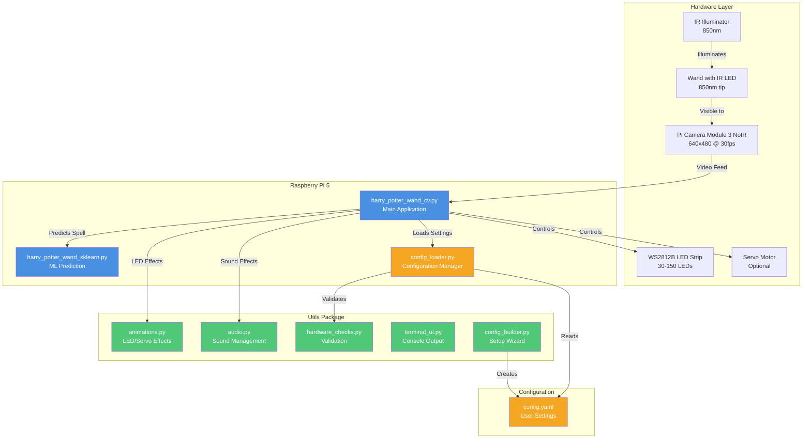
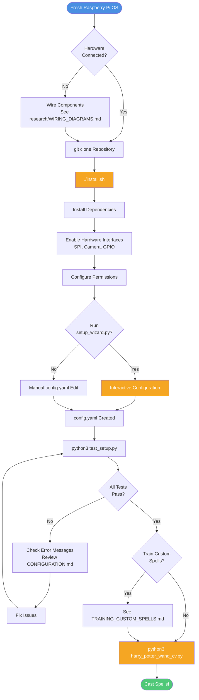

# Interactive Wand - Technical Guide

> **Looking for a quick start?** See the main [README.md](../README.md) for simple setup instructions.

A personal passion project recreating the magic of spellcasting through computer vision, machine learning, and themed show control — all powered by a Raspberry Pi 5 and written entirely in Python.

**Original Project:** [Andrew Congdon (Gloworm72)](https://github.com/Gloworm72/InteractiveWand) | [Project Webpage](https://andrewcongdon14.wixsite.com/andrew-congdon/interactive-wand)

---

## Hardware Requirements

### Required Components

| Component | Specification | Notes |
|-----------|--------------|-------|
| **Raspberry Pi** | Raspberry Pi 5 (4GB+ recommended) | Pi 4 may work but requires different LED setup |
| **Camera** | Raspberry Pi Camera Module 3 NoIR (Wide Angle) | NoIR (no infrared filter) essential for IR tracking |
| **LED Strip** | WS2812B DC5V Addressable RGB LED Strip | 30-150 LEDs recommended, IP65/IP68 waterproof |
| **IR Illuminator** | **Option A:** Camera-mounted 850nm IR ring (5W)<br>**Option B:** External 850nm IR board (DC12V, 42+ LEDs) | **Option A:** Simpler - mounts directly on camera, powered by camera module, 1-3m range<br>**Option B:** More powerful - separate board, requires 12V PSU, 5-10m range |
| **Power Supply** | 5V/27W USB-C PD for Pi 5 | Official Raspberry Pi adapter recommended |
| **Power Supply** | 5V/2-5A for LED strip | Separate PSU based on LED count (60mA per LED) |
| **Power Supply** | 12V/2A for external IR illuminator | Only if using Option B external IR board |
| **MicroSD Card** | 32GB+ Class 10 | For Raspberry Pi OS |
| **Wand** | Any object with IR LED at tip | 850nm IR LED + coin battery works well |

### Optional Components

| Component | Specification | Purpose |
|-----------|--------------|---------|
| **Servo Motor** | Standard hobby servo (SG90 or similar) | For physical box opening/closing effect |
| **Breadboard** | Half-size or full-size | For prototyping MOSFET circuit |
| **MOSFET** | Logic-level N-channel (IRLZ34N/IRLZ44N) | For PWM control of IR illuminator brightness |
| **Resistors** | 470Ω (LED data line), 10kΩ (MOSFET pull-down) | Circuit protection |
| **Capacitor** | 1000µF electrolytic | Power smoothing for LED strip |

### Component Notes

- **Servo is OPTIONAL**: The wand tracking, spell recognition, and LED/audio effects work without it
- **LED Strip Length**: 30 LEDs sufficient for small displays; 150+ for larger installations
- **IR Illuminator Options**:
  - **Camera-Mounted (Recommended for beginners)**: Simplest setup - mounts directly on camera module, powers from camera, no external wiring, perfect for 1-3m tracking distance
  - **External Board**: More powerful illumination for larger spaces (5-10m), requires 12V PSU and optional MOSFET for brightness control
- **Wand Construction**: Any IR LED (850nm) attached to stick/wand with power works as tracking point

### Raspberry Pi 5 Compatibility

> **Important:** This project is designed specifically for **Raspberry Pi 5** and uses the SPI-based `pi5neo` library for LED control.

#### Why SPI Instead of PWM?

Traditional WS2812B LED control methods (like `rpi_ws281x` or `adafruit-neopixel`) use GPIO18 with PWM/DMA. **These methods do NOT work on Raspberry Pi 5** due to the new RP1 southbridge chip that handles GPIO differently.

This project uses the **SPI method** instead:
- LED data is sent via SPI0 (Pin 19 / GPIO10 / MOSI)
- Controlled through `/dev/spidev0.0`
- Uses the `pi5neo` library (installed automatically)

#### Requirements for Pi 5

| Requirement | How It's Met |
|-------------|--------------|
| SPI enabled | `install.sh` adds `dtparam=spi=on` to config |
| `pi5neo` library | `install.sh` runs `pip3 install pi5neo` |
| User in `spi` group | `install.sh` runs `usermod -a -G spi` |
| LED on Pin 19 | Connect LED DIN to Physical Pin 19 (GPIO10/MOSI) |

#### Raspberry Pi 4 and Earlier

This project is **not directly compatible** with Raspberry Pi 4 or earlier models. If you need Pi 4 support:
- Use `rpi_ws281x` library instead of `pi5neo`
- Connect LED to GPIO18 (Pin 12) instead of GPIO10 (Pin 19)
- Modify `harry_potter_wand_cv.py` to use the different library

---

## System Architecture

Visual overview of how the Interactive Wand system components work together:



**Key Components:**
- **Hardware Layer**: Physical components (camera, LEDs, IR, optional servo)
- **Main Application**: Core gesture detection and show control
- **Utils Package**: Reusable modules for LED animations, audio, and hardware validation
- **Configuration**: YAML-based settings loaded dynamically

---

## Installation Flow



---

## Automated Installation

### Prerequisites
1. Fresh Raspberry Pi OS (Bookworm or newer) installed and updated
2. Hardware connected according to wiring diagrams
3. Internet connection for downloading dependencies

### One-Command Installation

```bash
cd /path/to/Interactive-Wand-Gesture-Recognition
./install.sh
```

The installer will:
- Install all system dependencies (OpenCV, NumPy, scikit-learn, etc.)
- Install Python packages (pi5neo, picamera2, pygame, etc.)
- Enable hardware interfaces (SPI, Camera, GPIO)
- Configure user permissions
- Validate configuration and assets
- Create necessary directories

### Interactive Setup Wizard

After installation, run the setup wizard to configure your hardware:

```bash
python3 setup_wizard.py
```

The wizard will guide you through:
- LED strip configuration (count, timing, SPI device)
- Camera settings (resolution, exposure, gain)
- Servo setup (optional - disabled by default)
- IR illuminator configuration
- Blob detector tuning
- Audio volume settings

All settings are saved to `config.yaml` and can be edited manually later.

### Configuration Management

All project paths and hardware settings are now centralized in `config.yaml`:

```yaml
hardware:
  led:
    count: 30              # Number of LEDs
    spi_device: "/dev/spidev0.0"
  servo:
    enabled: false         # Set to true if you have a servo
  camera:
    resolution: [640, 480]
    exposure_time: 8000
```

**No more hardcoded paths!** The system automatically detects project location using Python's `pathlib`.

### Testing Your Setup

Validate everything works correctly:

```bash
python3 test_setup.py
```

This will check:
- Hardware permissions (SPI, Camera, GPIO)
- Required files (sounds, model, config)
- Python dependencies
- Camera detection
- LED strip communication

---

## How Gesture Detection Works

The Interactive Wand uses computer vision and machine learning to recognize spell gestures in real-time:

```mermaid
flowchart LR
    CAM[Camera Feed<br/>640x480 @ 30fps] --> GRAY[Convert to<br/>Grayscale]

    GRAY --> BLOB[SimpleBlobDetector<br/>Find Wand Tip]

    BLOB --> FOUND{Blob<br/>Found?}

    FOUND -->|No| WAIT[Wait for Wand]
    FOUND -->|Yes| TRACK[Track Position]

    WAIT --> CAM

    TRACK --> MOVE{Moving?}

    MOVE -->|Yes| TRACE[Add to Trace Path]
    MOVE -->|No| STILL[Increment Stillness Timer]

    TRACE --> CHECK{Stillness<br/>Duration Met?}
    STILL --> CHECK

    CHECK -->|No| CAM
    CHECK -->|Yes| EXTRACT[Extract Trace Mask]

    EXTRACT --> PREPROCESS[Resize to 28x28<br/>Normalize]

    PREPROCESS --> ML[SVM Classifier<br/>Predict Spell]

    ML --> SPELL{Which<br/>Spell?}

    SPELL -->|Alohamora| PURPLE[Purple LED Animation<br/>Servo Open]
    SPELL -->|Colloportus| BLUE[Blue LED Animation<br/>Servo Close]
    SPELL -->|Unknown| IGNORE[Ignore Gesture]

    PURPLE --> SOUND1[Play Sound Effect]
    BLUE --> SOUND2[Play Sound Effect]

    SOUND1 --> RESET[Reset State]
    SOUND2 --> RESET
    IGNORE --> RESET

    RESET --> CAM

    style CAM fill:#4a90e2,color:#fff
    style ML fill:#f5a623,color:#fff
    style PURPLE fill:#9b59b6,color:#fff
    style BLUE fill:#3498db,color:#fff
```



**Detection Pipeline:**

1. **Camera Capture** - Pi Camera Module 3 NoIR captures grayscale video
2. **Blob Detection** - OpenCV finds bright IR LED on wand tip
3. **Gesture Tracing** - Tracks wand position over time, building a path
4. **Spell Recognition** - SVM classifier analyzes trace shape (28x28 image)
5. **Show Control** - Triggers LED animations, servo movements, and sound effects

**Key Parameters** (tunable in `config.yaml`):
- `stillness_duration`: How long wand must be still to complete gesture (default: 1.0s)
- `movement_threshold`: Minimum pixel movement to count as motion (default: 6px)
- `min_area`/`max_area`: Blob size range for wand detection (default: 15-500px²)

---

## Hardware Setup

Detailed setup instructions for each component. **See** [research/WIRING_DIAGRAMS.md](research/WIRING_DIAGRAMS.md) for visual circuit diagrams.

### 1. Raspberry Pi 5 Preparation

1. **Install Raspberry Pi OS**
   - Download Raspberry Pi OS (64-bit, Bookworm or newer)
   - Use Raspberry Pi Imager to flash microSD card
   - Enable SSH and configure WiFi during imaging (recommended)

2. **Initial Boot**
   - Insert microSD card and power on with 27W USB-C adapter
   - Complete setup wizard (locale, password, updates)
   - Update system: `sudo apt update && sudo apt upgrade -y`

3. **Enable Required Interfaces**
   ```bash
   sudo raspi-config
   # Navigate to: 3 Interface Options
   # Enable: I4 SPI (for LED strip)
   # Enable: I1 Camera (for camera module)
   # Reboot when prompted
   ```

### 2. WS2812B LED Strip Wiring

**CRITICAL:** Raspberry Pi 5 uses different GPIO than Pi 4. Use **GPIO10 (Pin 19)** with SPI, NOT GPIO18.

**Wiring Connections:**
```
LED Strip DIN  →  Raspberry Pi Pin 19 (GPIO10 MOSI)
LED Strip GND  →  Raspberry Pi GND (Pin 6) + PSU GND (common ground)
LED Strip 5V   →  External 5V PSU positive (NEVER use Pi 5V pins)

Optional:
470Ω Resistor  →  Between Pi Pin 19 and LED DIN (data line protection)
1000µF Cap     →  Between LED strip 5V and GND (power smoothing)
```

**Power Calculation:**
- Each LED draws ~60mA at full brightness white
- 30 LEDs = 1.8A, 60 LEDs = 3.6A, 150 LEDs = 9A
- Choose PSU with 20% overhead: 30 LEDs → 2A PSU, 60 LEDs → 4.5A PSU

**Setup Steps:**
1. Connect LED strip GND to both Pi GND AND PSU GND (common ground essential)
2. Connect LED strip 5V to external PSU only
3. Connect LED strip DIN to Pi Pin 19 (optionally through 470Ω resistor)
4. Solder 1000µF capacitor across LED strip power wires (optional but recommended)
5. Test: Run `python3 -c "from pi5neo import Pi5Neo; neo = Pi5Neo('/dev/spidev0.0', 30, 800); neo.fill_strip(255,0,0); neo.update_strip()"`

**Reference:** See [research/WS2812B_RaspberryPi5_Integration_Report.md](research/WS2812B_RaspberryPi5_Integration_Report.md) for complete details and troubleshooting.

### 3. Camera Module 3 NoIR Installation

**Physical Connection:**
1. Power off Raspberry Pi
2. Locate CSI connector between USB ports (22-pin connector)
3. Pull up black tab on CSI connector
4. Insert Camera Module 3 ribbon cable (blue/silver side facing USB ports)
5. Push down black tab to lock cable
6. Power on and verify: `rpicam-hello -t 5000`

**Software Configuration:**
1. Install picamera2:
   ```bash
   sudo apt install -y python3-picamera2 python3-opencv
   ```

2. Verify camera detection:
   ```bash
   rpicam-hello --list-cameras
   # Should show: IMX708 Wide Angle NoIR
   ```

3. **NoIR-Specific Settings** (Manual exposure required for IR tracking):
   ```python
   from picamera2 import Picamera2

   picam2 = Picamera2()
   config = picam2.create_preview_configuration(
       main={"size": (640, 480), "format": "RGB888"}
   )
   picam2.configure(config)

   # Manual settings for IR blob tracking
   picam2.set_controls({
       "AeEnable": False,           # Disable auto-exposure
       "AwbEnable": False,          # Disable auto white balance
       "ExposureTime": 8000,        # 8ms exposure (adjust based on IR brightness)
       "AnalogueGain": 6.0,         # Higher gain for low light
       "Brightness": -0.3           # Reduce brightness to prevent saturation
   })

   picam2.start()
   ```

**Reference:** See [research/CAMERA_MODULE_3_NOIR_RESEARCH.md](research/CAMERA_MODULE_3_NOIR_RESEARCH.md) for optimization, troubleshooting, and advanced configuration.

### 4. IR Illuminator Setup

**SAFETY:** 850nm IR LEDs are eye-safe at >1 meter distance. Avoid staring directly at LEDs from close range.

Choose between two IR illuminator options based on your needs:

---

#### **Option A: Camera-Mounted IR Ring (Recommended for Beginners)**

**Best for:** Simple setup, 1-3m tracking distance, minimal wiring

**Hardware:** 5W 850nm IR LED ring/board that mounts directly on Camera Module 3

**Installation:**
1. **Power off** Raspberry Pi
2. **Attach IR ring** to Camera Module 3:
   - Connect to camera module's 5V and GND pins
   - Ensure LEDs face forward (same direction as lens)
   - Secure with mounting clips/adhesive (usually included)
3. **Power on** - IR LEDs illuminate automatically with camera

**Configuration:**
```yaml
# config.yaml
hardware:
  ir_illuminator:
    enabled: false  # No GPIO control - powered by camera

  camera:
    exposure_time: 12000  # Increased for camera-mounted IR
    analogue_gain: 8.0    # Higher gain for dimmer IR source
```

**Testing:**
```bash
rpicam-hello -t 5000 --shutter 12000 --gain 8
# Point wand at camera - IR tip should appear bright
```

**Advantages:**
- No external wiring or PSU
- All-in-one with camera
- Compact and portable
- Always on when camera is on
- Perfect for typical wand casting distance (1-2m)

---

#### **Option B: External IR Board (For Larger Spaces)**

**Best for:** 5-10m tracking distance, larger rooms, higher power needs

**Hardware:** 42+ LED 850nm IR board (DC12V)

**Simple Setup (Always-On):**
1. Connect IR board positive to 12V PSU positive
2. Connect IR board GND to 12V PSU GND
3. Connect 12V PSU GND to Raspberry Pi GND (common ground)
4. Power on - LEDs will be invisible to eye but visible to camera

**Advanced Setup (PWM Brightness Control):**

**Components Needed:**
- Logic-level N-channel MOSFET (IRLZ34N, IRLZ44N, or IRL540N)
- 10kΩ resistor (pull-down for MOSFET gate)
- Optional: fuse holder + 2A fuse

**Wiring:**
```
Pi GPIO18 (Pin 12)  →  10kΩ resistor  →  MOSFET Gate
Pi GND (Pin 14)     →  MOSFET Source  →  IR Board GND
12V PSU Positive    →  IR Board Positive
12V PSU GND         →  MOSFET Drain
12V PSU GND         →  Pi GND (common ground)
```

**Configuration:**
```yaml
# config.yaml
hardware:
  ir_illuminator:
    enabled: true   # For PWM control
    gpio_pin: 18
    pwm_frequency: 1000

  camera:
    exposure_time: 8000   # Standard for powerful IR
    analogue_gain: 6.0
```

**Python Control Example:**
```python
from gpiozero import PWMOutputDevice

ir_led = PWMOutputDevice(18, frequency=1000)
ir_led.value = 0.5  # 50% brightness
```

**Positioning:**
- Mount IR illuminator near camera (co-axial or ring mount ideal)
- Distance from tracking area: 1-5 meters optimal
- Test with camera view to ensure even illumination

---

**Reference:** See [research/IR_ILLUMINATOR_INTEGRATION_RESEARCH.md](research/IR_ILLUMINATOR_INTEGRATION_RESEARCH.md) for complete circuit diagrams, safety guidelines, and troubleshooting. See [research/WIRING_DIAGRAMS.md](research/WIRING_DIAGRAMS.md) for visual schematics.

### 5. (Optional) Servo Motor Setup

**If you want the physical box opening/closing effect:**

1. **Wiring:**
   ```
   Servo Brown (GND)   →  Pi GND (Pin 9)
   Servo Red (5V)      →  Pi 5V (Pin 4) or external 5V if servo draws >500mA
   Servo Orange (PWM)  →  Pi GPIO12 (Pin 32)
   ```

2. **Software:**
   ```bash
   sudo apt install -y python3-gpiozero pigpio
   sudo systemctl enable pigpio
   sudo systemctl start pigpio
   ```

3. **Test:**
   ```python
   from gpiozero import Servo
   from gpiozero.pins.pigpio import PiGPIOFactory

   factory = PiGPIOFactory()
   servo = Servo(12, pin_factory=factory)
   servo.min()  # Test min position
   servo.max()  # Test max position
   ```

**Note:** The existing code in `harry_potter_wand_cv.py` will work with this setup. If you skip servo, comment out servo-related lines (11, 40-43, 112-151, 178, 183, 301) or the script will error on servo import.

---

## Software Setup (Manual Method)

> **TIP:** For automated installation, see the [Automated Installation](#automated-installation) section above. The manual method below is provided for advanced users who want full control over the installation process.

### 1. Install Python Dependencies

```bash
# Update package list
sudo apt update

# Install required libraries
sudo apt install -y python3-pip python3-opencv python3-picamera2 \
                     python3-numpy python3-pil python3-pygame \
                     python3-sklearn python3-joblib pigpio

# Install Pi5Neo for LED control (SPI-based for Pi 5)
pip3 install pi5neo --break-system-packages

# If using servo:
sudo apt install -y python3-gpiozero
sudo systemctl enable pigpio
sudo systemctl start pigpio
```

### 2. Clone/Download Project

```bash
cd ~
git clone <your-repo-url> WandProject
cd WandProject
```

Or download and extract ZIP to `/home/<username>/WandProject`

### 3. Configure File Paths

> **DEPRECATED:** Manual path configuration is no longer required! The project now uses dynamic path resolution via `pathlib` and `config.yaml`. If you used the automated installer or `setup_wizard.py`, skip this step.

For legacy/manual setup, edit `config.yaml` to customize paths:

```yaml
paths:
  sounds_dir: "Sounds"
  model_file: "new_custom_classifier.pkl"
  dataset_dir: "DatasetCreation"
```

The system automatically resolves all paths relative to the project root.

### 4. Test Components Individually

**Test LED Strip:**
```bash
python3 -c "
from pi5neo import Pi5Neo
neo = Pi5Neo('/dev/spidev0.0', 30, 800)
neo.fill_strip(255, 0, 0)
neo.update_strip()
print('Red = success!')
"
```

**Test Camera:**
```bash
rpicam-hello -t 5000
# Should show camera preview for 5 seconds
```

**Test IR Illuminator:**
```bash
# Point camera at tracking area
rpicam-still -o test.jpg --shutter 10000 --gain 6
# Open test.jpg - IR LEDs should appear as bright spots
```

**Test Audio:**
```bash
python3 -c "
import pygame
pygame.mixer.init()
sound = pygame.mixer.Sound('Sounds/Alohamora.mp3')
sound.play()
import time; time.sleep(3)
"
```

### 5. Calibrate Blob Detector

The SimpleBlobDetector parameters (lines 50-62 in `harry_potter_wand_cv.py`) may need adjustment:

```python
params.minThreshold = 180  # Adjust if wand tip not detected
params.maxThreshold = 255
params.minArea = 15        # Adjust based on wand distance
params.maxArea = 500
params.minCircularity = 0.75  # Lower if wand tip not perfectly round
```

**Tuning Process:**
1. Run script: `python3 harry_potter_wand_cv.py`
2. Wave wand in camera view
3. If wand not detected: lower `minThreshold` or `minCircularity`
4. If false detections: increase `minThreshold` or `minArea`
5. Check "Gray Feed" window to see what camera sees

---

## Getting Started

### First Run

1. **Setup Environment:**
   ```bash
   cd ~/WandProject
   # Ensure IR illuminator is on and pointing at tracking area
   # Ensure LED strip is powered and connected
   ```

2. **Run Main Script:**
   ```bash
   python3 harry_potter_wand_cv.py
   ```

3. **Windows That Appear:**
   - "Wand Tracking" - Shows detected wand path and trace
   - "Gray Feed" - Shows raw camera view (for debugging)

4. **Test Spell Casting:**
   - Hold wand with IR LED tip visible to camera
   - Wait 0.6 seconds in view (trace will start)
   - Draw spell gesture (upward swirl for "Alohamora", downward swirl for "Colloportus")
   - Hold still for 1 second at end
   - LED animation and sound should play if gesture recognized

5. **Exit:**
   - Press 'q' key in any window to exit safely

### Calibration Tips

- **IR LED Too Dim:** Increase IR illuminator brightness or move closer
- **IR LED Too Bright:** Reduce IR illuminator brightness or increase `params.minThreshold`
- **False Detections:** Ensure room has no other bright IR sources (sunlight, reflections)
- **Wand Not Detected:** Check "Gray Feed" - wand tip should appear as bright white dot
- **Spell Not Recognized:** Ensure gesture matches training data (draw deliberately, full strokes)

### Training Custom Gestures

If you want to add new spells or retrain existing ones:

1. Navigate to dataset creation:
   ```bash
   cd DatasetCreation
   ```

2. Draw training samples:
   ```bash
   python3 draw_spell_data.py
   # Follow on-screen instructions to draw gestures
   ```

3. Convert to training format:
   ```bash
   python3 convert_to_training_data.py
   ```

4. Train new classifier:
   ```bash
   python3 train_spell_classifier.py
   # Outputs new_custom_classifier.pkl
   ```

See existing dataset in `DatasetCreation/` for reference gesture shapes.

**For detailed instructions on adding custom spells with different LED colors, see [TRAINING_CUSTOM_SPELLS.md](TRAINING_CUSTOM_SPELLS.md)**

---

## Testing & Validation

### Hardware Validation (Raspberry Pi)

After setting up your hardware, run the validation suite:

```bash
# Full hardware validation
python3 test_setup.py
```

This checks:
- Python dependencies (numpy, opencv, pi5neo, etc.)
- Camera availability
- SPI device access
- LED strip initialization
- Audio system
- ML model loading

### LED Animation Demo

Test LED animations without casting spells:

```bash
python3 test_led_demo.py
# or
make led-demo
```

Interactive menu options:
- **Basic tests**: Solid colors, color wipe, rainbow, brightness levels
- **Spell animations**: Alohamora (purple), Colloportus (blue)
- Works with or without servo motor

### Automated Test Suite

Run the full test suite in Docker (no hardware required):

```bash
# Run all tests in Docker (recommended)
make test-docker

# Or run locally (requires PyYAML installed)
make test-local
```

| Test Suite | What It Validates |
|------------|-------------------|
| `test-syntax` | Python file compilation |
| `test-config` | Configuration structure and loading |
| `test-gpio` | GPIO pin assignments and conflicts |
| `test-mocks` | Hardware mock implementations |
| `test-animations` | Animation logic with mocked hardware |
| `test-docs` | Documentation completeness |

### Quick Validation Commands

```bash
# Check config syntax
python3 -c "import yaml; yaml.safe_load(open('config.yaml'))"

# Check config loading
python3 -c "from config_loader import get_config; print(get_config().project.name)"

# Check SPI device
ls -la /dev/spidev0.0

# Check user groups
groups $USER | grep -E "(spi|gpio|video)"
```

### Reflector Wand Calibration

If you're using a Universal Studios interactive wand (reflector-based rather than IR LED):

```bash
python3 calibrate_reflector.py
# or
make calibrate
```

The interactive calibrator provides:
- **Real-time camera feed** with detection overlay
- **Live parameter adjustment** via keyboard controls
- **Automatic config.yaml updates** on save

| Key | Setting | Effect |
|-----|---------|--------|
| W/S | brightness_threshold | Higher = less sensitive |
| E/D | min_threshold | Lower = detect dimmer spots |
| R/F | min_area | Lower = detect smaller spots |
| T/G | max_jump_distance | Higher = allow faster movement |
| Y/H | required_frames | Lower = faster response |
| Q | Save & Quit | Saves settings to config.yaml |
| ESC | Quit | Exit without saving |
| SPACE | Reset | Restore default values |

**Calibration Tips:**
- Wave your wand in front of the camera while adjusting settings
- Green circle = valid tracking, Yellow circle = detecting but not yet confirmed
- Lower `brightness_threshold` if wand tip not detected
- Increase `required_frames` if getting false detections

---

## Troubleshooting

### LED Strip Issues

| Problem | Solution |
|---------|----------|
| LEDs don't light up | Verify SPI enabled (`ls /dev/spidev0.0` should exist). Check common ground connection between Pi and PSU. Verify 5V PSU is powered and outputting correct voltage. Test with simple script (see Software Setup) |
| Random flickering | Add 1000µF capacitor across LED power lines. Ensure common ground connected. Check for loose wiring. Use external PSU (not Pi 5V pins) |
| Only first few LEDs work | Insufficient power supply current. Add power injection for strips >150 LEDs. Check LED strip data connection (DIN pin) |
| Wrong colors | Check LED strip is WS2812B (not WS2811/SK6812). Verify Pi5Neo timing parameter (800 for WS2812B) |

**Reference:** [research/WS2812B_RaspberryPi5_Integration_Report.md](research/WS2812B_RaspberryPi5_Integration_Report.md) Section 8

### Camera Issues

| Problem | Solution |
|---------|----------|
| "Camera not detected" | Check ribbon cable connection (blue side toward USB). Run `rpicam-hello --list-cameras` to verify. Ensure camera interface enabled in raspi-config. Try different CSI port if Pi has multiple |
| Wand tip not detected | Increase IR illuminator brightness. Lower `params.minThreshold` in code (line 51). Check IR LED is 850nm (940nm less visible to camera). Verify camera is NoIR model (not standard) |
| Image too bright/dark | Adjust `ExposureTime` (line 38 equivalent in your setup). Adjust `AnalogueGain` setting. Change IR illuminator brightness |
| Excessive motion blur | Reduce exposure time: `ExposureTime: 5000` (5ms). Ensure adequate IR illumination |

**Reference:** [research/CAMERA_MODULE_3_NOIR_RESEARCH.md](research/CAMERA_MODULE_3_NOIR_RESEARCH.md) Section 7

### IR Illuminator Issues

| Problem | Solution |
|---------|----------|
| IR LEDs not turning on | Check 12V power supply with multimeter. Verify polarity (red=+12V, black=GND). View IR LEDs through phone camera (should glow purple/white). Check fuse if installed |
| Brightness not adjustable | Verify MOSFET circuit if using PWM control. Check GPIO18 configured as PWM output. Test MOSFET with multimeter (gate-source voltage ~3.3V) |
| Camera sees uniform brightness (no contrast) | IR illuminator too close or too bright. Move illuminator further from camera. Reduce PWM duty cycle. Add diffuser to IR board |

**Reference:** [research/IR_ILLUMINATOR_INTEGRATION_RESEARCH.md](research/IR_ILLUMINATOR_INTEGRATION_RESEARCH.md) Section 6, [research/WIRING_DIAGRAMS.md](research/WIRING_DIAGRAMS.md) Section 12

### Spell Recognition Issues

| Problem | Solution |
|---------|----------|
| Spell not recognized | Draw gesture more deliberately (full, clear strokes). Ensure trace includes 10+ points (check console output). Verify stillness_duration allows completion (1 second still). Retrain classifier with more samples |
| Wrong spell detected | Ensure gesture matches training data shape. Check last saved trace: `lastframe.jpg`. Retrain classifier if needed |
| False triggers from reflections | Increase `presence_duration_threshold` (line 74). Use lower `minCircularity` to avoid detecting non-wand glints. Eliminate IR reflective surfaces in view |
| Trace canceled too quickly | Increase `stillness_duration_threshold` (line 75). Draw gestures faster (less than 3 seconds total) |

### General Issues

| Problem | Solution |
|---------|----------|
| Import errors | Verify all dependencies installed (`pip3 list`). Check Python version: `python3 --version` (3.9+). Reinstall packages: `pip3 install --force-reinstall pi5neo` |
| Servo errors (if not using servo) | Comment out servo lines (11, 40-43, 112-151, 178, 183, 301). Or install gpiozero even if not using servo |
| Audio not playing | Check HDMI/headphone audio output selected. Test speaker: `speaker-test -t wav -c 2`. Verify Sounds/ directory exists with MP3 files |
| High CPU usage | Reduce camera resolution (edit line 33: 320x240). Increase frame processing delay. Close unnecessary applications |

---

## Project Summary

This wand system detects spellcasting gestures in real-time using OpenCV and an infrared-lit wand. It recognizes and responds to two specific spells:

- **"Alohamora"** — triggers warm purple fire LED animation with sound effect
- **"Colloportus"** — triggers cool blue flame LED animation with sound effect

The system features:

- Real-time IR blob tracking and wand path tracing using NoIR camera
- Spell recognition using a trained SVM classifier (99%+ accuracy)
- Custom LED animations tied to spell type (WS2812B addressable RGB)
- Themed sound effects with seamless background music
- Filtering to prevent false or accidental spell detection
- *(Optional)* Servo-based physical box movement for opening/closing effect

**Hardware Flexibility:** System designed to work with or without servo motor. Core functionality (tracking, recognition, LEDs, audio) operates independently of physical actuation components.

All code runs on-device using multithreaded Python on Raspberry Pi 5.

---

## Technologies Used

- **Hardware:**
  - `Raspberry Pi 5` with RP1 chipset (Pi 4 compatible with different LED wiring)
  - `Camera Module 3 NoIR (Wide Angle)` with Sony IMX708 sensor
  - `WS2812B` addressable RGB LED strip (DC5V, SPI control on Pi 5)
  - `850nm IR Illuminator` for night vision blob tracking
  - *(Optional)* `Hobby Servo` for physical box actuation

- **Computer Vision:**
  - `OpenCV` (cv2) for video processing and blob detection
  - `picamera2` for Camera Module 3 control with libcamera backend
  - `SimpleBlobDetector` with tuned parameters for IR LED tracking

- **Machine Learning:**
  - `scikit-learn` SVM with `GridSearchCV` for spell classification
  - Custom dataset of 400+ hand-drawn wand traces
  - `joblib` for model persistence

- **Hardware Control:**
  - `Pi5Neo` library for WS2812B LED control over SPI (Raspberry Pi 5 specific)
  - `pigpio` and `gpiozero` for GPIO/PWM control (servo, IR illuminator)
  - Hardware PWM for smooth servo actuation (if using servo)

- **Audio:**
  - `pygame.mixer` for real-time sound effects and background music
  - Layered audio with volume ducking for spell SFX

- **Performance:**
  - Multi-threaded Python for concurrent vision, hardware, and audio processing
  - Lock-based prediction queue to prevent race conditions

---

## Spellcasting Flow


---

## File Overview

**harry_potter_wand_cv.py**

Main runtime script: blob detection, trace drawing, spell prediction, and show control.

**harry_potter_wand_sklearn.py**

Used to run the pre-trained SVM classifier concurrently.

**new_custom_classifier.pkl**

Pre-trained model for classifying spells based on trace shape. (Train your own with `train_spell_classifier.py`)

**lastframe.jpg**

Latest wand trace visualization, saved for debugging or training.

**Sounds/**

Sound effects and background music used in spellcasting.

**DatasetCreation/**

Python for drawing custom training data, converting that training data into the correct format, training the SVM classifier to produce the .pkl file

---

## ML & Classification

I created a custom dataset by collecting over 400 wand path traces drawn in-air. These were:

- Centered and normalized
- Smoothed and resampled
- Converted to vector features

I used `GridSearchCV` to tune a Support Vector Machine (SVM) classifier that could distinguish between gestures with over 99% accuracy.

The classifier runs on-device in real time with minimal latency.

---

## Show Control Highlights

- **LED FX** – Custom "fire" animations with randomized color flickers using `Pi5Neo` SPI interface
- **Audio Layers** – Spell SFX mixed over looping background music via `pygame.mixer`
- **Gesture Filtering** – Start and stop conditions prevent noisy traces from triggering spells
- **IR Tracking** – Blob detection optimized for 850nm IR LED visibility with NoIR camera
- **Servo Logic** *(Optional)* – Smooth actuation of box lid using hardware PWM and `pigpio` (can be disabled)

**Note:** System works fully without servo motor - LED animations and spell recognition function independently.

---

## Demo Video

[](https://www.youtube.com/watch?v=IFpQFHPK7W4)

*Click the image to watch the full demo.*

---

## Final Thoughts

This was one of the most technically rewarding projects I've created — combining embedded hardware, computer vision, machine learning, and interactive storytelling. It's a small glimpse into how software and show control can bring magic to life.

---

## Technical References

This project includes comprehensive research documentation for hardware setup:

- **[research/WS2812B_RaspberryPi5_Integration_Report.md](research/WS2812B_RaspberryPi5_Integration_Report.md)** - Complete guide for addressable LED strips on Pi 5 using SPI, including wiring diagrams, power calculations, and troubleshooting (50+ sources)

- **[research/CAMERA_MODULE_3_NOIR_RESEARCH.md](research/CAMERA_MODULE_3_NOIR_RESEARCH.md)** - Raspberry Pi Camera Module 3 NoIR setup, configuration for IR tracking, picamera2 integration, and optimization techniques (50+ sources)

- **[research/IR_ILLUMINATOR_INTEGRATION_RESEARCH.md](research/IR_ILLUMINATOR_INTEGRATION_RESEARCH.md)** - 850nm IR illuminator setup, MOSFET control circuits, safety guidelines, and computer vision integration (60+ sources)

- **[research/WIRING_DIAGRAMS.md](research/WIRING_DIAGRAMS.md)** - Visual ASCII circuit diagrams for all hardware components including MOSFET circuits, breadboard layouts, and GPIO pinouts (12 detailed diagrams)

### Usage & Customization Guides

- **[TRAINING_CUSTOM_SPELLS.md](TRAINING_CUSTOM_SPELLS.md)** - Complete guide for training new spell gestures and creating custom LED color animations

These documents contain 150+ curated URLs to official documentation, community forums, academic papers, and technical guides.
