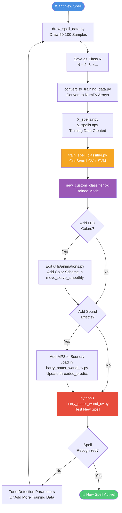

# Training Custom Spells & LED Colors

Complete guide for adding new spell gestures with custom LED animations to the Interactive Wand project.

## 📚 Table of Contents

- [Overview](#overview)
- [Quick Start](#quick-start)
- [Detailed Training Process](#detailed-training-process)
- [Adding Custom LED Colors](#adding-custom-led-colors)
- [Adding Sound Effects](#adding-sound-effects)
- [Color Reference Guide](#color-reference-guide)
- [Advanced Customization](#advanced-customization)
- [Troubleshooting](#troubleshooting)

---

## Overview

The Interactive Wand system uses a Support Vector Machine (SVM) classifier to recognize hand-drawn spell gestures. By default, it recognizes two spells:

- **Class 0 - "Alohamora"** → Purple fire LED animation
- **Class 1 - "Colloportus"** → Blue fire LED animation

You can train unlimited custom spells (Class 2, 3, 4...) with your own gesture shapes and LED color schemes.

### What You'll Need

- Working Interactive Wand setup
- Mouse or drawing tablet for creating training data
- Text editor for code modifications
- (Optional) MP3 sound effects for your spells

### Training Pipeline

Complete workflow from gesture drawing to spell casting:



**Key Steps:**
1. **Draw Samples** - Create 50-100 training examples of your spell gesture
2. **Convert Data** - Transform drawings into 28x28 NumPy arrays
3. **Train Model** - Use scikit-learn SVM with hyperparameter tuning
4. **Customize Effects** - Edit `utils/animations.py` for LED colors
5. **Add Sound** - (Optional) Include MP3 spell sound effects
6. **Test & Tune** - Validate recognition and adjust parameters

---

## Quick Start

```bash
# 1. Create training data
cd DatasetCreation
python3 draw_spell_data.py
# Draw 50-100 samples, label with class number (2, 3, 4...)

# 2. Convert training data
python3 convert_to_training_data.py

# 3. Train new classifier
python3 train_spell_classifier.py

# 4. Edit harry_potter_wand_cv.py to add LED colors (see below)

# 5. Test your new spell!
python3 harry_potter_wand_cv.py
```

---

## Module Architecture Note

After recent refactoring, LED animations and audio are managed by dedicated utility modules:

**LED Effects** (`utils/animations.py`):
- `move_servo_smoothly(neo, servo, target_func)` - Main LED animation function
- `spell_fade_out(neo, spell)` - Fade-out effect after spell completes
- `lerp(a, b, t)` - Linear interpolation helper

**Sound Effects** (`utils/audio.py`):
- `play_spell_sound(sound_effect, background_volume)` - Play spell sound with volume ducking

**Main Application** (`harry_potter_wand_cv.py`):
- `threaded_predict(mask)` - Spell prediction and effect triggering

When adding custom spells, you'll primarily edit:
1. `utils/animations.py` - Add new LED color schemes
2. `harry_potter_wand_cv.py` - Load new sound effects and update prediction logic

This modular structure makes it easier to add new spells without cluttering the main detection loop.

---

## Detailed Training Process

### Step 1: Create Training Data

```bash
cd DatasetCreation
python3 draw_spell_data.py
```

**Drawing Guidelines:**

1. **Draw your gesture shape** - Use mouse to draw the wand path
   - Simple shapes work best: circles, spirals, zigzags, waves
   - Complex shapes may be harder to reproduce consistently

2. **Class numbering:**
   - Class 0: Alohamora (already exists)
   - Class 1: Colloportus (already exists)
   - Class 2: Your first new spell
   - Class 3: Your second new spell
   - Continue with 4, 5, 6...

3. **Sample quantity:**
   - Minimum: 30 samples per spell
   - Recommended: 50-100 samples per spell
   - More samples = better accuracy

4. **Variation tips:**
   - Draw at different sizes (small, medium, large)
   - Draw at different speeds (slow, fast)
   - Draw at different angles (if gesture allows)
   - Draw with slight imperfections (realistic use)

**Example Training Session:**

```
Class 2 - "Lumos" (circle shape):
- 25 small circles
- 25 medium circles
- 25 large circles
- 25 slightly imperfect circles
Total: 100 samples

Class 3 - "Incendio" (zigzag shape):
- 30 tight zigzags
- 30 wide zigzags
- 30 angled zigzags
- 10 irregular zigzags
Total: 100 samples
```

### Step 2: Convert Training Data

```bash
python3 convert_to_training_data.py
```

This script:
- Centers all drawings
- Normalizes size
- Smooths paths
- Resamples to consistent point counts
- Converts to feature vectors

**What to watch for:**
- Script should report number of samples per class
- Check for balanced dataset (similar sample counts)
- If one class has way more samples, it may bias the classifier

### Step 3: Train the Classifier

```bash
python3 train_spell_classifier.py
```

The script will:
- Load all training data
- Split into train/test sets
- Use GridSearchCV to find optimal SVM parameters
- Train final model
- Report accuracy metrics
- Save to `new_custom_classifier.pkl`

**Expected Output:**
```
Training SVM classifier...
Best parameters: {'C': 10, 'gamma': 0.001, 'kernel': 'rbf'}
Cross-validation accuracy: 98.5%
Test set accuracy: 97.2%
Classifier saved to: new_custom_classifier.pkl
```

**Accuracy targets:**
- Excellent: >95%
- Good: 90-95%
- Needs improvement: <90% (add more training samples)

### Step 4: Test the Raw Classifier

Before modifying code, test if the classifier works:

```bash
cd ..
python3 harry_potter_wand_sklearn.py
```

Wave your wand and check console output. It should print class numbers (0, 1, 2, 3...).

---

## Adding Custom LED Colors

Now configure LED animations for your new spells by editing `harry_potter_wand_cv.py`.

### A. Update `spell_fade_out()` Function

Location: **Line ~88**

Add your spell's fade-out effect:

```python
def spell_fade_out(spell):
    steps = 20
    for s in range(steps):
        fade = 1 - (s / steps)
        for i in range(num_leds):
            flicker = 0.9 + 0.2 * random.random()

            if spell == "open":  # Purple - Alohamora
                r = int(100 * fade * flicker)
                g = int(20 * fade * flicker)
                b = int(160 * fade * flicker)
            elif spell == "close":  # Blue - Colloportus
                r = int(30 * fade * flicker)
                g = int(100 * fade * flicker)
                b = int(255 * fade * flicker)

            # ADD YOUR NEW SPELLS HERE
            elif spell == "lumos":  # Green - Class 2
                r = int(20 * fade * flicker)
                g = int(255 * fade * flicker)
                b = int(50 * fade * flicker)
            elif spell == "incendio":  # Red - Class 3
                r = int(255 * fade * flicker)
                g = int(30 * fade * flicker)
                b = int(30 * fade * flicker)
            elif spell == "aqua":  # Cyan - Class 4
                r = int(30 * fade * flicker)
                g = int(200 * fade * flicker)
                b = int(255 * fade * flicker)

            else:
                r = g = b = 0

            neo.set_led_color(i, r, g, b)
        neo.update_strip()
        time.sleep(0.02)
    neo.fill_strip(0, 0, 0)
    neo.update_strip()
```

### B. Update `move_servo_smoothly()` Function

Location: **Line ~112**

Add animated LED effects during spell casting:

```python
def move_servo_smoothly(target_func):
    duration = 1.2
    servo_steps = 30
    led_refresh_delay = 0.005
    start_time = time.time()
    last_servo_step = -1

    while True:
        elapsed = time.time() - start_time
        progress = min(elapsed / duration, 1)
        fade_in = min(progress * 1.5, 1)
        beat_phase = math.sin(time.time() * 2 * math.pi * 1.2)
        brightness_scale = 0.7 + 0.3 * (0.5 + 0.5 * beat_phase)

        # Servo movement (only for open/close if you have servo)
        if target_func in ["open", "close"]:
            current_step = int(progress * servo_steps)
            if current_step != last_servo_step:
                val = -1 + progress * 2 if target_func == "open" else 1 - progress * 2
                servo.value = val
                last_servo_step = current_step

        # LED animations
        for j in range(num_leds):
            wave_phase = elapsed * 25 + j * 0.3
            wave = 0.5 + 0.5 * math.sin(wave_phase)
            flicker = 0.95 + 0.1 * math.sin(elapsed * 60 + j)

            if target_func == "open":  # Purple - Alohamora
                r = int(lerp(100, 180, wave) * flicker * fade_in * brightness_scale)
                g = int(lerp(30, 60, wave) * flicker * fade_in * brightness_scale)
                b = int(lerp(180, 255, wave) * flicker * fade_in * brightness_scale)
            elif target_func == "close":  # Blue - Colloportus
                r = int(lerp(30, 70, wave) * flicker * fade_in * brightness_scale)
                g = int(lerp(100, 200, wave) * flicker * fade_in * brightness_scale)
                b = int(lerp(200, 255, wave) * flicker * fade_in * brightness_scale)

            # ADD YOUR NEW SPELLS HERE
            elif target_func == "lumos":  # Green - Class 2
                r = int(lerp(20, 50, wave) * flicker * fade_in * brightness_scale)
                g = int(lerp(200, 255, wave) * flicker * fade_in * brightness_scale)
                b = int(lerp(50, 100, wave) * flicker * fade_in * brightness_scale)
            elif target_func == "incendio":  # Red - Class 3
                r = int(lerp(200, 255, wave) * flicker * fade_in * brightness_scale)
                g = int(lerp(30, 80, wave) * flicker * fade_in * brightness_scale)
                b = int(lerp(30, 60, wave) * flicker * fade_in * brightness_scale)
            elif target_func == "aqua":  # Cyan - Class 4
                r = int(lerp(30, 80, wave) * flicker * fade_in * brightness_scale)
                g = int(lerp(180, 220, wave) * flicker * fade_in * brightness_scale)
                b = int(lerp(200, 255, wave) * flicker * fade_in * brightness_scale)

            else:
                r = g = b = 0

            # Random sparkles
            if random.random() < 0.02:
                r, g, b = 255, 255, 255

            neo.set_led_color(j, r, g, b)
        neo.update_strip()
        time.sleep(led_refresh_delay)

        if progress >= 1:
            break

    spell_fade_out(target_func)
    time.sleep(0.2)

    # Only detach servo if you used it
    if target_func in ["open", "close"]:
        servo.detach()
```

### C. Update Prediction Handling

Location: **Line ~175** (in the `threaded_predict()` function)

Map classifier predictions to spell names:

```python
def threaded_predict(mask):
    global lastMove, predicting
    try:
        mask = cv2.GaussianBlur(mask, (5, 5), 0)
        _, mask = cv2.threshold(mask, 80, 255, cv2.THRESH_BINARY)
        mask = cv2.resize(mask, (28, 28), interpolation=cv2.INTER_AREA)
        mask = cv2.dilate(mask, (3, 3))
        cv2.imwrite(LASTFRAME_PATH, mask)

        from harry_potter_wand_sklearn import predict_spell
        prediction = str(predict_spell(LASTFRAME_PATH, MODEL_PATH))
        print("Prediction:", prediction)

        if prediction == "0" and lastMove == 0:
            print("Alohamora!!")
            play_spell_sound(ALOHA_SOUND)
            move_servo_smoothly("open")
            lastMove = 1
        elif prediction == "1" and lastMove == 1:
            print("Colloportus!!")
            play_spell_sound(COLLO_SOUND)
            move_servo_smoothly("close")
            lastMove = 0

        # ADD YOUR NEW SPELLS HERE
        elif prediction == "2":
            print("Lumos!!")
            # play_spell_sound(LUMOS_SOUND)  # Add if you have sound
            move_servo_smoothly("lumos")
        elif prediction == "3":
            print("Incendio!!")
            # play_spell_sound(INCENDIO_SOUND)
            move_servo_smoothly("incendio")
        elif prediction == "4":
            print("Aguamenti!!")
            # play_spell_sound(AQUA_SOUND)
            move_servo_smoothly("aqua")

    finally:
        with prediction_lock:
            predicting = False
```

**Note:** For spells without servo movement, you don't need the `lastMove` state checking. Only "open" and "close" need that to prevent repeating the same servo action.

---

## Adding Sound Effects

### Step 1: Prepare Sound Files

1. Find or create MP3 sound effects for your spells
2. Place them in the `Sounds/` directory
3. Name them clearly: `Lumos.mp3`, `Incendio.mp3`, etc.

### Step 2: Load Sounds in Script

Location: **Line ~24** (top of script)

```python
# Initialize audio and load sound effects/music
mixer.init()
ALOHA_SOUND = mixer.Sound(os.path.join(PROJECT_DIR, "Sounds", "Alohamora.mp3"))
COLLO_SOUND = mixer.Sound(os.path.join(PROJECT_DIR, "Sounds", "Colloportus.mp3"))

# ADD YOUR NEW SPELL SOUNDS HERE
LUMOS_SOUND = mixer.Sound(os.path.join(PROJECT_DIR, "Sounds", "Lumos.mp3"))
INCENDIO_SOUND = mixer.Sound(os.path.join(PROJECT_DIR, "Sounds", "Incendio.mp3"))
AQUA_SOUND = mixer.Sound(os.path.join(PROJECT_DIR, "Sounds", "Aguamenti.mp3"))

BACKGROUND_TRACK = os.path.join(PROJECT_DIR, "Sounds", "loop.mp3")
mixer.music.load(BACKGROUND_TRACK)
mixer.music.set_volume(0.6)
mixer.music.play(-1)
```

### Step 3: Play Sounds in Prediction Handler

Uncomment the `play_spell_sound()` lines in the prediction handler (see previous section).

---

## Color Reference Guide

### RGB Color Values

Use these as starting points for your spell colors:

#### Fire & Heat
```python
"red_fire":       (255, 50, 30)     # Hot intense fire
"orange_fire":    (255, 140, 0)     # Orange flames
"yellow_fire":    (255, 220, 50)    # Yellow flames
"white_fire":     (255, 255, 255)   # Searing white heat
"pink_fire":      (255, 100, 150)   # Pink mystical flames
```

#### Elemental Magic
```python
"water_blue":     (30, 150, 255)    # Water spell
"ice_cyan":       (100, 220, 255)   # Ice/frost magic
"lightning_blue": (200, 220, 255)   # Electric blue
"earth_brown":    (139, 90, 43)     # Earth/stone magic
"nature_green":   (50, 255, 80)     # Growth/nature magic
"wind_white":     (230, 240, 255)   # Wind/air magic
```

#### Mystical Colors
```python
"arcane_purple":  (180, 50, 255)    # Arcane magic
"dark_purple":    (100, 20, 150)    # Dark arcane
"light_gold":     (255, 215, 0)     # Light/healing magic
"shadow_black":   (20, 20, 40)      # Shadow/dark magic
"ethereal_white": (255, 250, 240)   # Divine/holy magic
"toxic_green":    (150, 255, 50)    # Poison/venom
```

#### Exotic Effects
```python
"rainbow":        (varies)          # Cycle through hue
"silver":         (192, 192, 192)   # Metallic silver
"gold":           (255, 215, 0)     # Metallic gold
"copper":         (184, 115, 51)    # Metallic copper
"aurora":         (100, 255, 200)   # Northern lights
```

### Creating Custom Gradients

Use `lerp(start, end, progress)` to create smooth color transitions:

```python
# Example: Red-to-yellow fire gradient
r = int(lerp(255, 255, wave) * flicker * fade_in * brightness_scale)  # Red stays high
g = int(lerp(50, 220, wave) * flicker * fade_in * brightness_scale)   # Green increases
b = int(lerp(30, 50, wave) * flicker * fade_in * brightness_scale)    # Blue stays low
```

### Color Temperature Guide

- **Warm colors** (red, orange, yellow): Fire, heat, passion
- **Cool colors** (blue, cyan, purple): Ice, water, calm
- **Neutral colors** (green, white): Nature, light, balance
- **Dark colors** (black, dark purple): Shadow, mystery, dark magic

---

## Advanced Customization

### Animation Speed

Adjust animation duration:

```python
def move_servo_smoothly(target_func):
    duration = 1.2  # Default
    # duration = 0.8   # Faster animation
    # duration = 2.0   # Slower, dramatic animation
```

### Wave Patterns

Modify the wave effect for different looks:

```python
# Default wave (smooth)
wave = 0.5 + 0.5 * math.sin(wave_phase)

# Fast pulsing
wave = 0.5 + 0.5 * math.sin(wave_phase * 2)

# Slow ripple
wave = 0.5 + 0.5 * math.sin(wave_phase * 0.5)

# Sharp pulse (square wave)
wave = 1.0 if math.sin(wave_phase) > 0 else 0.0
```

### Sparkle Density

Control random white sparkles:

```python
# Default: 2% chance per LED
if random.random() < 0.02:
    r, g, b = 255, 255, 255

# More sparkles (5%)
if random.random() < 0.05:
    r, g, b = 255, 255, 255

# Fewer sparkles (0.5%)
if random.random() < 0.005:
    r, g, b = 255, 255, 255

# No sparkles
# (Just remove the if block)
```

### Brightness Control

Adjust overall brightness:

```python
# Default brightness scale
brightness_scale = 0.7 + 0.3 * (0.5 + 0.5 * beat_phase)

# Dimmer
brightness_scale = 0.4 + 0.2 * (0.5 + 0.5 * beat_phase)

# Brighter
brightness_scale = 0.9 + 0.1 * (0.5 + 0.5 * beat_phase)

# Constant (no pulsing)
brightness_scale = 0.8
```

### Creating Rainbow Effect

For a rainbow spell that cycles through all colors:

```python
elif target_func == "rainbow":
    # Hue cycles from 0-360 over time
    hue = (elapsed * 100) % 360
    # Each LED offset slightly for rainbow sweep
    led_hue = (hue + j * 10) % 360

    # Convert HSV to RGB (simplified)
    c = 255
    x = int(c * (1 - abs((led_hue / 60) % 2 - 1)))

    if led_hue < 60:
        r, g, b = c, x, 0
    elif led_hue < 120:
        r, g, b = x, c, 0
    elif led_hue < 180:
        r, g, b = 0, c, x
    elif led_hue < 240:
        r, g, b = 0, x, c
    elif led_hue < 300:
        r, g, b = x, 0, c
    else:
        r, g, b = c, 0, x

    r = int(r * fade_in * brightness_scale)
    g = int(g * fade_in * brightness_scale)
    b = int(b * fade_in * brightness_scale)
```

---

## Troubleshooting

### Classifier Not Recognizing New Spells

**Symptom:** Always predicts 0 or 1, never your new classes

**Solutions:**
1. Check training data exists for new classes:
   ```bash
   cd DatasetCreation
   ls -la  # Look for files labeled with your class numbers
   ```

2. Verify classifier was retrained:
   ```bash
   ls -la new_custom_classifier.pkl
   # Check timestamp - should be recent
   ```

3. Add more training samples (aim for 50-100 per spell)

4. Make gesture shapes more distinct from existing spells

### Low Accuracy

**Symptom:** Classifier reports <90% accuracy

**Solutions:**
1. Add more training samples (especially for confused classes)
2. Make gestures more distinct
3. Remove ambiguous/poorly drawn samples
4. Ensure balanced dataset (similar sample counts per class)

### Wrong LED Colors

**Symptom:** LED shows wrong color or no color

**Solutions:**
1. Check prediction number matches your elif condition:
   ```python
   print("Prediction:", prediction)  # See what number is output
   ```

2. Verify spell name string matches exactly:
   ```python
   # These must match:
   move_servo_smoothly("lumos")     # In prediction handler
   elif target_func == "lumos":      # In LED functions
   ```

3. Check RGB values are reasonable (0-255 range)

4. Test with solid color first before gradients:
   ```python
   r, g, b = 255, 0, 0  # Pure red - simple test
   ```

### LEDs Not Lighting

**Symptom:** No LED response when spell cast

**Solutions:**
1. Check LED strip power supply connected
2. Verify `neo.update_strip()` is called
3. Test LEDs independently:
   ```python
   neo.fill_strip(255, 0, 0)
   neo.update_strip()
   ```

4. Check brightness values aren't multiplied to zero:
   ```python
   print(f"RGB: {r}, {g}, {b}")  # Debug brightness
   ```

### Gesture Too Hard to Draw

**Symptom:** Can't reliably cast spell during use

**Solutions:**
1. Simplify the gesture shape
2. Train with more variation
3. Lower threshold requirements:
   ```python
   # In harry_potter_wand_cv.py
   params.minCircularity = 0.5  # Lower from 0.75 for less strict shapes
   ```

4. Increase stillness duration to allow more time:
   ```python
   stillness_duration_threshold = 1.5  # Increase from 1.0
   ```

### Sound Not Playing

**Symptom:** LED animation works but no sound

**Solutions:**
1. Check MP3 file exists and path is correct:
   ```bash
   ls -la Sounds/Lumos.mp3
   ```

2. Verify sound is loaded correctly (no errors on startup)

3. Test sound independently:
   ```python
   LUMOS_SOUND.play()
   time.sleep(2)
   ```

4. Check audio output device selected:
   ```bash
   speaker-test -t wav -c 2
   ```

---

## Example: Complete Spell Implementation

Here's a full example of adding "Lumos" (green light spell):

### 1. Training Data
```bash
cd DatasetCreation
python3 draw_spell_data.py
# Draw 75 circle shapes, label as class 2
python3 convert_to_training_data.py
python3 train_spell_classifier.py
# Reports >95% accuracy
```

### 2. Code Changes

**spell_fade_out():**
```python
elif spell == "lumos":
    r = int(20 * fade * flicker)
    g = int(255 * fade * flicker)
    b = int(50 * fade * flicker)
```

**move_servo_smoothly():**
```python
elif target_func == "lumos":
    r = int(lerp(20, 50, wave) * flicker * fade_in * brightness_scale)
    g = int(lerp(200, 255, wave) * flicker * fade_in * brightness_scale)
    b = int(lerp(50, 100, wave) * flicker * fade_in * brightness_scale)
```

**Prediction handler:**
```python
elif prediction == "2":
    print("Lumos!!")
    play_spell_sound(LUMOS_SOUND)
    move_servo_smoothly("lumos")
```

**Sound loading:**
```python
LUMOS_SOUND = mixer.Sound(os.path.join(PROJECT_DIR, "Sounds", "Lumos.mp3"))
```

### 3. Test
```bash
python3 harry_potter_wand_cv.py
# Draw circle gesture
# Should see green LED animation and hear sound
```

---

## Tips for Success

1. **Start Simple:** Add one spell at a time, test thoroughly before adding more
2. **Distinct Gestures:** Make each spell shape clearly different
3. **Quality Over Quantity:** 50 good samples better than 100 poor samples
4. **Test Incrementally:** Test classifier before modifying code, test code section by section
5. **Use Meaningful Names:** Choose spell names that match the gesture/color
6. **Document Your Spells:** Keep a list of class numbers → spell names → colors
7. **Backup Your Work:** Copy `new_custom_classifier.pkl` before retraining

---

## Need Help?

- Check the main [README.md](../README.md) for hardware setup
- Review [Troubleshooting section](../README.md#troubleshooting) for general issues
- Examine `DatasetCreation/` scripts for training examples
- Test each component independently before combining

Happy spellcasting! ✨🪄
